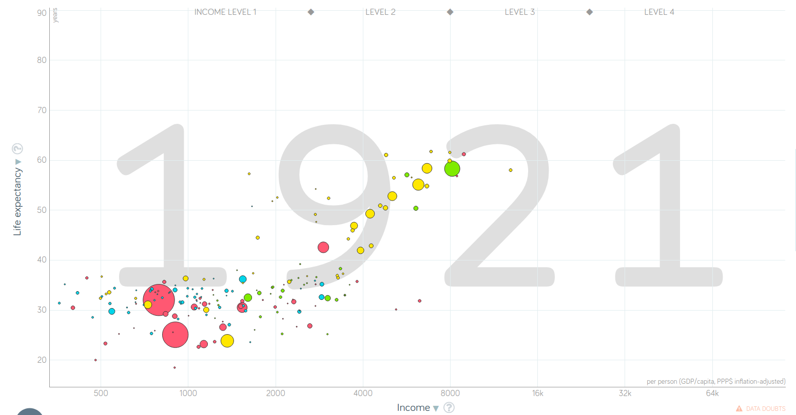

# 20 Mars

## Hans Rosling

[Article wikipedia](https://fr.wikipedia.org/wiki/Hans_Rosling)

[](https://www.youtube.com/watch?v=jbkSRLYSojo)

Le [graphique](https://www.gapminder.org/tools/#$chart-type=bubbles) que nous allons reproduire.



Dans les graphiques que nous avons créé jusqu'ici (bâtons, camemberts...), un seul jeu de donnée est encodé en éléments visuels. Dans ce cas nous en avons cinq:

* L'espérance de vie sur l'axe vértical
* Le PNB par habitant sur l'axe horizontal
* La population dans la taille des bulles
* La région dans les couleurs des bulles
* Le temps dans avec le "slider" en bas du graphique

### Les données

Nous avons 4 jeux de données:

* [Espérance de vie](https://raw.githubusercontent.com/Gapminder-Indicators/lex/master/lex-by-gapminder.xlsx)
* [PNB par habitant](https://raw.githubusercontent.com/Gapminder-Indicators/gdppc_cppp/master/gdppc_cppp-by-gapminder.xlsx)
* [Population](https://docs.google.com/spreadsheets/d/18Ep3s1S0cvlT1ovQG9KdipLEoQ1Ktz5LtTTQpDcWbX0/export?format=xlsx)
* [Régions](https://docs.google.com/spreadsheets/d/1qHalit8sXC0R8oVXibc2wa2gY7bkwGzOybEMTWp-08o/export?format=xlsx)

Chacun de ces jeux de données représente une liste de pays avec des données par année. Ils ont tous une colonne `geo` avec le code en trois lettres [iso-3166-1-alpha-3](https://en.wikipedia.org/wiki/ISO_3166-1_alpha-3). Nous allons utiliser cette colonne pour joindre les données. Toutes ces données sont fournies par [gapminder](https://www.gapminder.org/data/documentation/gd000/). Il rare qu'il soit aussi facile de joindre des séries de données. Nous avons de la chance.

:boom: **test**


#### Télécharger les données

Nous utilisons [curl](https://curl.haxx.se/) pour télécharger les données dans un dossier `rosling_data/temp` 

```bash
curl https://raw.githubusercontent.com/Gapminder-Indicators/lex/master/lex-by-gapminder.xlsx \
> rosling_data/temp/esperance_de_vie.xlsx

curl https://raw.githubusercontent.com/Gapminder-Indicators/gdppc_cppp/master/gdppc_cppp-by-gapminder.xlsx \
> rosling_data/temp/pnb_p_habitant.xlsx

curl https://docs.google.com/spreadsheets/d/18Ep3s1S0cvlT1ovQG9KdipLEoQ1Ktz5LtTTQpDcWbX0/export?format=xlsx \
> rosling_data/temp/population.xlsx

curl https://docs.google.com/spreadsheets/d/1qHalit8sXC0R8oVXibc2wa2gY7bkwGzOybEMTWp-08o/export?format=xlsx \
> rosling_data/temp/regions.xlsx
```

Tous les fichiers sont au format `xlsx`. En parlant de différents formats de données lors du [cours du 28 Février](https://github.com/idris-maps/heig-datavis-2020/tree/master/20200228#formats), j'ai dit que la manière la plus facile de traiter ce type de fichier est de copier-coller la partie qui vous intéresse dans un fichier `csv`. Le problème avec toutes les manipulations manuelles est qu'on ne se souvient pas toujours de ce qu'on a fait. Et même si nous avons pris note de la procédure, nous devons répéter ces gestes à chaque fois que nous souhaitons mettre à jour ces données. 

Nous allons utiliser la librairie [xlsx](https://www.npmjs.com/package/xlsx) pour extraire les données de ces fichiers.

```
npm install xlsx --save
```

Convertir un `xlsx` en `csv` fonctionne de la manière suivante:

```js
const xlsx = require('xlsx')

const xlsxFile = xlsx.readFile( CHEMIN_VERS_LE_FICHIER )

xlsx.utils.sheet_to_csv(xlsxFile.Sheets[ FEUILLE ])
```

Nous devons passer le chemin vers le fichier pour qu'il puisse être lu. Puis la fonction `sheet_to_csv` doit savoir quelle feuille doit être convertie.

Nous pourrions créer un scripte pour chaque jeu de données. Pour ne pas nous répéter nous allons en créer un seul auquel nous pouvons passer le chemin vers le fichier et le nom de la feuille.

##### Lire les arguments de la console dans un script `nodejs`

Imaginons un scripte `20200320/lire_argv.js` comme ceci:

```js
console.log(process.argv)
```

Si je lance la commande suivante sur mon ordinateur:

```
node 20200320/lire_argv
```

La console retourne:

```js
[
  '/home/anders/.nvm/versions/node/v12.11.1/bin/node',
  '/home/anders/heig-datavis-2020/20200320/lire_argv'
]
```

C'est un tableau de chaines de caractères. Le premier élément est où le programme `node` est installé, le deuxième est le chemin vers le scripte.

Essayons maintenant d'ajouter des arguments:

```
node 20200320/lire_argv un deux trois
```

La console retourne:

```js
[
  '/home/anders/.nvm/versions/node/v12.11.1/bin/node',
  '/home/anders/heig-datavis-2020/20200320/lire_argv',
  'un',
  'deux',
  'trois'
]
```

Nous voyons que nous pouvons passer des informations au script tout simplement en les ajoutant à la commande.

Revenons à nos données. Pour chaque fichier nous allons passer le nom du fichier et la feuille au scripte qui va convertir les `xlsx` en `csv`.

Créons un scripte `20200320/rosling_data/xslxToCsv.js`:

```js
const xlsx = require('xlsx')

const fileName = process.argv[2] // le nom du fichier est le 3e argument
const sheet = process.argv[3] // le nom de la feuille est le 4e argument

// __dirname est le chemin vers ce scripte
// nos fichiers sont dans un dossier "temp" par rapport à ce scripte
// les fichiers ont tous l'extension xlsx
const xlsxFile = xlsx.readFile(`${__dirname}/temp/${fileName}.xlsx`)

// passons le résultat à la console
console.log(xlsx.utils.sheet_to_csv(xlsxFile.Sheets[sheet]))
```

Nous pouvons maintenant utiliser ce même scripte pour convertir les quatre fichiers en utilisant ce format:

```bash
node data/xlsxToCsv NOM_DU_FICHIER NOM_DE_LA_FEUILLE > FICHIER_CSV
```

```bash
node data/xlsxToCsv esperance_de_vie countries_and_territories > data/temp/esperance_de_vie.csv

node data/xlsxToCsv pnb_p_habitant countries_and_territories > data/temp/pnb_p_habitant.csv

node data/xlsxToCsv population data-countries-etc-by-year > data/temp/population.csv

node data/xlsxToCsv regions list-of-countries-etc > data/temp/regions.csv
```

