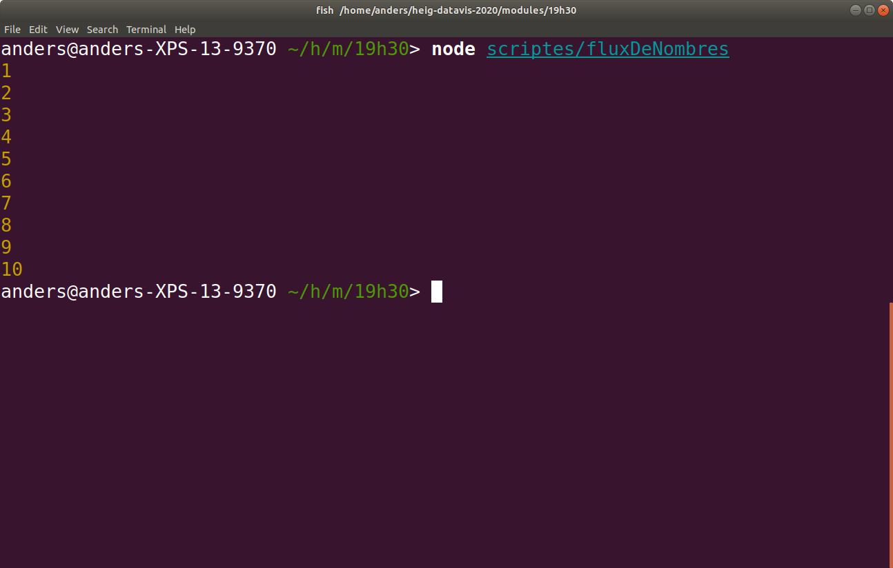
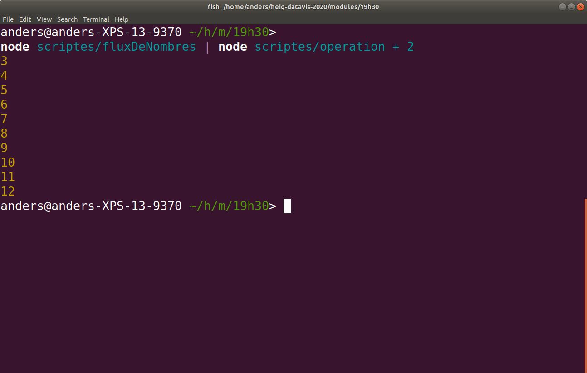
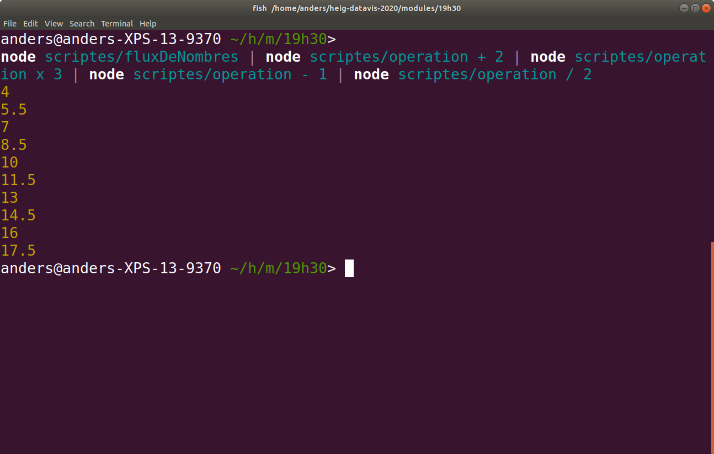
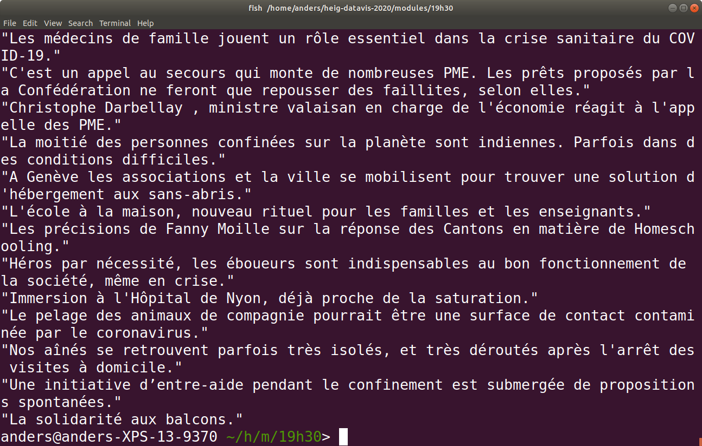
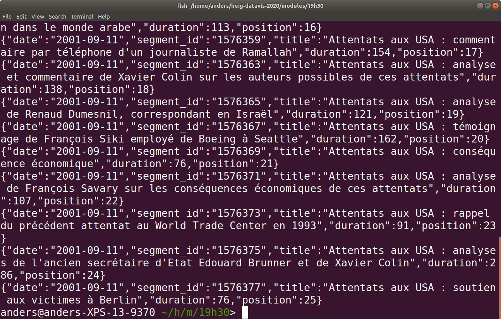
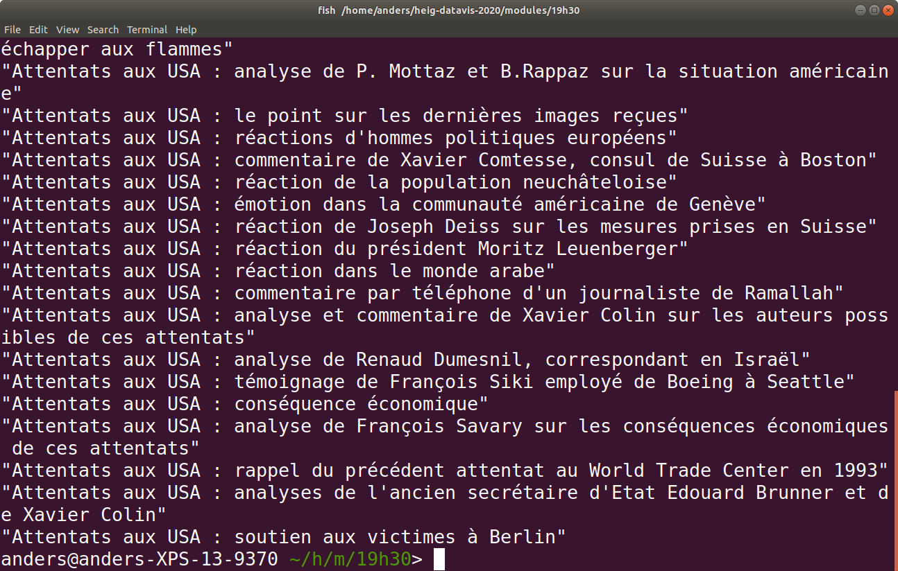
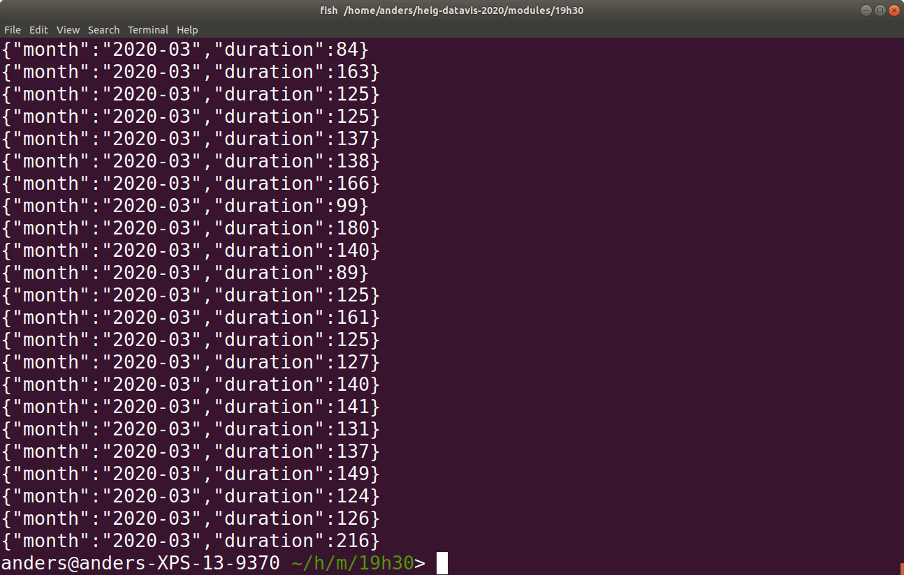
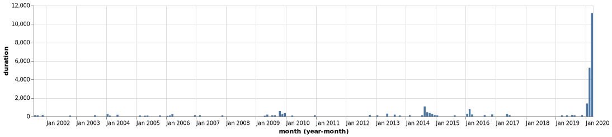
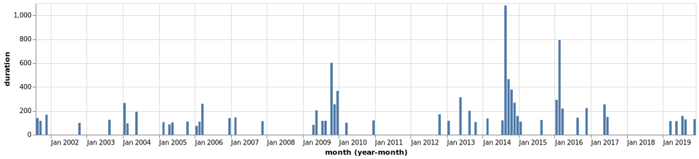
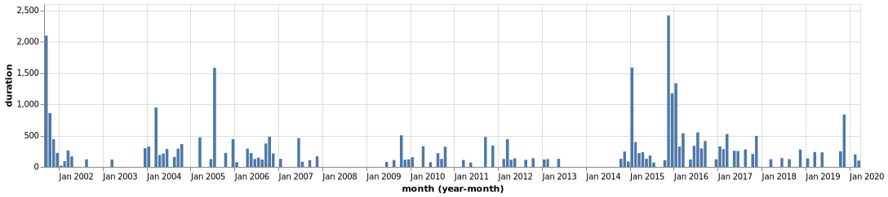

# Utiliser les données au format `.ndjson`

Nous avons obtenu deux fichiers `ndjson` en [téléchargeant les "épisodes" du 19h30 de la RTS](scrape.md):

* [`episodes.ndjson`](episodes.ndjson), tous les épisodes du 19h30
* [`segments.ndjson`](segments.ndjson), tous les sujets

## Le format

Un fichier [`.ndjson`](http://ndjson.org/) contient un `json` à chaque ligne.

```js
{ "name": "Pomme", "num": 5}
{ "name": "Pêche", "num": 3 }
{ "name": "Banane", "num": 6}
```

Ce n'est pas un tableau `json`. Celui-ci ressemble à ça:

```json
[
  { "name": "Pomme", "num": 5},
  { "name": "Pêche", "num": 3 },
  { "name": "Banane", "num": 6}
]
```

La différence est que pour lire un fichier `.json` nous devons charger le fichier en entier pour pouvoir le lire. Un fichier `.ndjson` peut être lu, et créé, ligne par ligne.

Quand nous avons téléchargé les données du 19h30, nous avons ouvert un fichier `scraped.ndjson` avec `fs.createWriteStream`. Et à chaque fois que nous obtenions des données, nous avons ajouté une ligne au fichier. Si nous avions souhaité créer un fichier `.json`, il aurait fallu garder les données en mémoire jusqu'à ce que nous les avions toutes pour finalement créer le fichier. Si le scripte avait retourné une erreur, nous aurions tout perdu puisque les données n'auraient pas été sauvées.

L'avantage principal de ce type de fichier est que nous n'avons pas besoin de garder les données en mémoire. Nous pouvons simplement les faire passer par un ou plusieurs scriptes, ligne par ligne. Le fichier `scraped.ndjson` pesait ~100Mb. Si ça avait été un `.json`, il aurait fallu mettre le tout en mémoire pour le manipuler. C'est tout à fait possible avec un ordinateur moderne. Mais si le fichier avait fait plusieurs gigabytes, on aurait eu des soucis. En lisant un fichier ligne par ligne la taille du fichier n'a pas d'importance.

## La tuyauterie

Nous avons vu que la fonction [`pipe` de `ramda`](https://ramdajs.com/docs/#pipe) permet d'appliquer plusieurs fonctions à la suite. Nous avons fait une opération similaire dans le terminal en créant par exemple le fichier `segments.ndjson`:

```
node scriptes/extractSegments < episodes.ndjson > segments.ndjson
```

* `<` passe chaque ligne de `episodes.ndjson` à `extractSegments` une à une
* `extractSegments` applique une transformation sur chaque ligne et crée plusieurs nouvelles lignes
* Celle-ci sont à leur tour passées une à une au fichier `segments.ndjson` avec `>`

En sortant du fichier `episodes.ndjson`, une ligne entre dans `extractSegments` qui en tire plusieurs lignes qui sont passées une à une au fichier `segments.ndjson`. C'est un flux de données qui passe d'un scripte à un autre. Nous pouvons ajouter des étapes en liant les fonctions avec `|`.

### Exemple de tuyauterie

Pour illustrer comment `|` fonctionne, créons un flux de données.

[`scriptes/fluxDeNombres.js`](scriptes/fluxDeNombres.js)

```js
const loop = (number, callback) => {
  if (number === 10) {
    return callback()
  }
  console.log(number)
  setTimeout(() => {
    loop(number + 1, callback)
  }, 200)
}

loop(1, () => console.log(10))
```

Ceci est une version modifiée de l'[exemple de boucle](scrape.md#point_up-un-example-de-boucle) présenté lors du téléchargement des données du 19h30. Chaque 200 millisecondes un nombre est envoyé à la console.

Quand je fais tourner le scripte, je vois:



Créons un autre scripte qui modifie ce flux.

[`scriptes/operation.js`](scriptes/operations.js)

```js
const readline = require('readline')

const operation = process.argv[2]
const number = Number(process.argv[3])

const reader = readline.createInterface({
  input: process.stdin,
})

reader.on('line', line => {
  const value = Number(line)
  if (operation === '+' && !isNaN(number)) {
    console.log(value + number)
  } else if (operation === '-' && !isNaN(number)) {
    console.log(value - number)
  } else if (operation === 'x' && !isNaN(number)) {
    console.log(value * number)
  } else if (operation === '/' && !isNaN(number)) {
    console.log(value / number)
  } else {
    console.log(value)
  }
})
```

Ceci est un lecteur ligne par ligne qui prends deux arguments, l'opérateur (`+`, `-`, `x` ou `/`) et un nombre. Il applique l'opération à la valeur entrante et recrache le résultat.

Ajoutons `2` à chaque nombre.



Maintenant chaque nombre passe par `operation + 2` et nous voyons le résultat dans la console.

Ajoutons plusieurs opérations.



Comme `fluxDeNombre` n'envoie qu'un nombre toutes les 200 millisecondes, nous pouvons voir que toutes les opérations sont appliquées au premier nombre avant qu'elles ne le soient au deuxième. Le scripte `operation` n'a pas besoin de connaître tous les nombres pour faire ce qu'il a à faire. Il applique sa transformation à la donnée entrante et passe le résultat à la prochaine étape.

## Utiliser la tuyauterie sur les données du 19h30

Nous allons maintenant explorer les données du journal de la RTS en utilisant la console. Pour ne pas avoir à créer chaque scripte comme `operation` nous allons utiliser la librairie [`ndjson-cli`](https://github.com/mbostock/ndjson-cli).

```
npm install ndjson-cli -g
```

---

### :point_up: Installer une librairie "globalement"

Vous observerez qu'en installant `ndjson-cli`, j'ai utilisé `-g` plutôt que `--save`. Ceci permet d'installer une libraire non seulement dans le projet actuel, comme nous avons fait jusqu'ici, mais globalement. C'est à dire que le code n'est pas sauvé dans le `node_module` du projet mais au niveau du système d'exploitation. Comme c'est une série de scriptes pour la ligne de commande, nous pouvons maintenant les utiliser partout sur notre ordinateur.

---

`ndjson-cli` contient une séries de scriptes pour manipuler les fichiers en utilisant une syntaxe proche de celle utilisée pour les opérations sur un tableau `json`. En voici deux exemple:

### [`ndjson-map`](https://github.com/mbostock/ndjson-cli#map)

Permet de faire ce que nous faisons avec `.map`, c'est à dire transformer chaque élément d'une liste. Imaginons que nous ne souhaitons avoir que les titres de `segments.ndjson`. 

Si ça avait été un tableau nous aurions fait:

```js
segments.map(d => d.title)
```

Avec `ndjson-map`, `d =>` est implicite:

```
ndjson-map "d.title" < segments.ndjson
```



### [`ndjson-filter`](https://github.com/mbostock/ndjson-cli#filter)

Sur un tableau, si nous ne souhaitons avoir que les segments du 11 Septembre 2001:

```js
segments.filter(d => d.date === '2001-09-11')
```

Avec `ndjson-filter`:

```
ndjson-filter "d.date === '2001-09-11'" < segments.ndjson
```



Pour avoir les titres du 11 Septembre 2001 combinons les deux:

```
ndjson-filter "d.date === '2001-09-11'" < segments.ndjson \
ndjson-map "d.title"
```



## Les épisodes les plus longs

Généralement un épisodes du 19h30 dure environ 30 minutes mais pour des événements exceptionnels la durée est allongée. Trouvons les 10 épisodes les plus longs.

```
ndjson-sort "a.duration > b.duration ? -1 : 1" < episodes.ndjson \
| head -10 \
| ndjson-map "{ firstTitle: d.segments[0].title, date: d.date, duration: Math.round(d.duration / 60) }" \
| ndjson-reduce
```

* `ndjson-sort 'a.duration > b.duration ? -1 : 1' < episodes.ndjson` ordonne les épisodes par durée
* `head -10` ceci est un scripte qui vient avec la console, il prends les 10 premières lignes
* `ndjson-map '{ firstTitle: d.segments[0].title, date: d.date, duration: Math.round(d.duration / 60) }'` pour chaque ligne nous prenons le titre du premier sujet, la date et la durée en minutes (elle est en secondes)
* `ndjson-reduce` sans arguments, crée un tableau `json` avec les lignes qui lui sont passées

Le résultat:

```json
[
	{
		"firstTitle": "Hommage à Michael Jackson: entretien avec David Brun-Lambert, journaliste",
		"date": "2009-07-07",
		"duration": 102
	},
	{
		"firstTitle": "L'Amérique en état de choc",
		"date": "2001-09-12",
		"duration": 79
	},
	{
		"firstTitle": "Un immense drapeau américain a été déployé sur la Maison Blanche 48 heures après les attentats aux USA",
		"date": "2001-09-13",
		"duration": 72
	},
	{
		"firstTitle": "Plusieurs patients français sont désormais soignés en Suisse dans différents cantons.",
		"date": "2020-03-29",
		"duration": 72
	},
	{
		"firstTitle": "Habemus Papam: le 5e tour de scrutin aura été le bon",
		"date": "2013-03-13",
		"duration": 66
	},
	{
		"firstTitle": "Elections: le nouveau Conseil national selon les projections, l'UDC en nette progression",
		"date": "2007-10-21",
		"duration": 62
	},
	{
		"firstTitle": "Les nouveaux visages de la vague verte en Suisse romande.",
		"date": "2019-10-20",
		"duration": 62
	},
	{
		"firstTitle": "On compte déjà 18 morts dans l'explosion d'une usine chimique à Toulouse",
		"date": "2001-09-21",
		"duration": 61
	},
	{
		"firstTitle": "Des milliers de manifestants pour Swissair et contre les banques",
		"date": "2001-10-04",
		"duration": 58
	},
	{
		"firstTitle": "Attentats aux USA : effondrement des 2 tours du World Trade Center",
		"date": "2001-09-11",
		"duration": 54
	}
]
```

## Temps consacré au mot "virus" par mois

```
ndjson-filter "d.title.toLowerCase().includes('virus')" < segments.ndjson \
| ndjson-sort "a.date > b.date ? 1 : 1" \
| ndjson-map "{ month: d.date.split('-').filter((e, i) => i < 2).join('-'), duration: d.duration }"
```

* `ndjson-filter "d.title.toLowerCase().includes('virus')" < segments.ndjson` filtre les sujets qui incluent `virus` dans le titre. (J'ai mis le titre en lettre minuscules pour aussi inclure `Virus`)
* `ndjson-sort "a.date > b.date ? 1 : 1"` ordonne les lignes par date
* `ndjson-map "{ month: d.date.split('-').filter((e, i) => i < 2).join('-'), duration: d.duration }"` ne prends que le mois (`YYYY-MM` plutôt que la date `YYYY-MM-DD`) et la durée.



J'ai essayé d'utiliser `ndjson-reduce` pour avoir la somme de la durée par mois mais le code devenait très long, illisible et difficile à débugger. Nous allons créer notre propre scripte pour cela. Pour le rendre utilisable en d'autres occasion je vais passer la clé sur laquelle nous souhaitons faire la somme, `duration` et la clé par laquelle nous souhaitons grouper les sommes, `month`.

[`scriptes/sum.js`](scriptes/sum.js)

```js
const readline = require('readline')
const R = require('ramda')

const keyToSum = process.argv[2]
const keyToSumBy = process.argv[3]

const reader = readline.createInterface({
  input: process.stdin,
})

let result = []

reader.on('line', line => {
  result.push(JSON.parse(line))
})

const reducer = (result, item) => {
  const sumBy = item[keyToSumBy]
  const value = Number(item[keyToSum])
  const exists = result.find(d => d.by === sumBy)
  if (exists) {
    return [
      ...result.filter(d => d.by !== sumBy),
      { ...exists, sum: exists.sum + value}
    ]
  }
  return [
    ...result,
    { by: sumBy, sum: value },
  ]
}

reader.on('close', () => {
  R.pipe(
    R.reduce(reducer, []),
    R.sortBy(R.prop('by')),
    R.map(d => ({ [keyToSumBy]: d.by, [keyToSum]: d.sum })),
    JSON.stringify,
    console.log
  )(result)
})
```

Le fichier est lu ligne par ligne. Quand une ligne arrive, elle est transformée en objet javascript et ajoutée au tableau `result`:

```js
let result = []

reader.on('line', line => {
  result.push(JSON.parse(line))
})
```

Quand toutes les lignes ont été lues `reader.on('close')`, nous appliquons `reducer` qui fait la somme. 

`reducer` retourne un tableau

```js
[
  // ...
  { by: '2020-01', sum: 100 },
  { by: '2020-02', sum: 200 },
  // ..
]
```

* Nous ordonnons le tableau par `by`
* Nous renommons `by` et `sum` pour utiliser les clés passées en argument `R.map(d => ({ [keyToSumBy]: d.by, [keyToSum]: d.sum }))`
* Transformons le résultat en ligne de caractères, `JSON.stringify` et l'envoyons à la console.

Utilisons ce scripte en passant les clés `duration` et `month`

```
ndjson-filter "d.title.toLowerCase().includes('virus')" < segments.ndjson \
| ndjson-sort "a.date > b.date ? 1 : 1" \
| ndjson-map "{ month: d.date.split('-').filter((e, i) => i < 2).join('-'), duration: d.duration }" \
| node scriptes/sum duration month
```

Le résultat:

```json
[
  {"month":"2001-08","duration":140},
  {"month":"2001-09","duration":116},
  {"month":"2001-11","duration":167},
  {"month":"2002-10","duration":99},
  {"month":"2003-08","duration":125},
  {"month":"2004-01","duration":266},
  {"month":"2004-02","duration":95},
  {"month":"2004-05","duration":192},
  {"month":"2005-02","duration":106},
  {"month":"2005-04","duration":86},
  {"month":"2005-05","duration":103},
  {"month":"2005-10","duration":110},
  {"month":"2006-01","duration":74},
  {"month":"2006-02","duration":109},
  {"month":"2006-03","duration":259},
  {"month":"2006-12","duration":139},
  {"month":"2007-02","duration":145},
  {"month":"2007-11","duration":113},
  {"month":"2009-04","duration":82},
  {"month":"2009-05","duration":204},
  {"month":"2009-07","duration":116},
  {"month":"2009-08","duration":117},
  {"month":"2009-10","duration":602},
  {"month":"2009-11","duration":255},
  {"month":"2009-12","duration":367},
  {"month":"2010-03","duration":100},
  {"month":"2010-12","duration":120},
  {"month":"2012-10","duration":171},
  {"month":"2013-01","duration":117},
  {"month":"2013-05","duration":313},
  {"month":"2013-08","duration":200},
  {"month":"2013-10","duration":106},
  {"month":"2014-02","duration":136},
  {"month":"2014-07","duration":120},
  {"month":"2014-08","duration":1082},
  {"month":"2014-09","duration":465},
  {"month":"2014-10","duration":378},
  {"month":"2014-11","duration":268},
  {"month":"2014-12","duration":157},
  {"month":"2015-01","duration":109},
  {"month":"2015-08","duration":123},
  {"month":"2016-01","duration":292},
  {"month":"2016-02","duration":792},
  {"month":"2016-03","duration":219},
  {"month":"2016-08","duration":142},
  {"month":"2016-11","duration":223},
  {"month":"2017-05","duration":254},
  {"month":"2017-06","duration":149},
  {"month":"2019-03","duration":114},
  {"month":"2019-05","duration":114},
  {"month":"2019-07","duration":157},
  {"month":"2019-08","duration":128},
  {"month":"2019-11","duration":130},
  {"month":"2020-01","duration":1408},
  {"month":"2020-02","duration":5285},
  {"month":"2020-03","duration":11175}
]
```

## Créer un scripte qui retourne un graphique

J'ai parlé rapidement de [vega-lite](https://vega.github.io/vega-lite/) en montrant [différentes librairies pour créer un graphique en bâtons](https://observablehq.com/@idris-maps/graphiques-en-batons). Ils ont un outil en ligne pour créer des graphiques. J'y ai copié-collé le résultat ci-dessus. Le graphique est disponible [ici](https://vega.github.io/editor/#/url/vega-lite/N4KABGBEAkDODGALApgWwIaQFxUQFzwAdYsB6UgN2QHN0A6agSz0QFcAjOxge1IRQyUa6ALQAbZskoAWOgCtY3AHaQANOCgATdHkw5gUCujGtksbGADaG4JFTKW2SACYADK4CMI1wA41kTVYAJx0eFSwPaVcAX3UIW3slRywXdy9XAE5-QJC8MOwPDwA2WJs7B0QnN08RQuzg0OUCooB2UvjypMqU6uda13rc-KwMjPawBIqq9wBmbz9VAIa8pojnAFZxya7p12lvD0HG8OcikriJzuTUve9nI5XwjM2L7evq-dd1h+GPDOctldujd1ncfqsPK5zmVEu93KC9uDwj5oR1YcDqgjvoscscCq4ZoD0btQZCkQVIUSpj13EUDuSsC1pFSdjSoWCcctfpkWXD2QSGRsxq8gbs6R57pyhhCZsKYdSbi0OUtpeFIi95azFbVDlK8REPISRcS2RlvNIGT4AcaFdUzV9BXteRj3PaWgzCqjLiabvaFir9YU2jatXb+gyiq5rZq+Wa6nrHtgNhq0bbXbVJQHE1gZq1ndNId4Zh73PmaYWJR63GXUhLwwnfi0PDW3Ib6Q2IR5gzGXW2HR3wjNDS3PHNfI6YiG4W2yQP8V63r3PpncdnDQvReXPu652tJz2C59-avuVaR5FvFld9IiinvWmL7Os8MZi0fOf9vHn6tTu+p0uMw9dZu1TUNPARXVvzVHl-wLBFjy5CFnCNA9yzpTxBX+c90JXRDwhaLDYLQotBT+bD5g9aRo1A6dxUgk8f2Q88lX7KCk3WZkiNrFiikouUaN7e1i13QpONQ2t7WxNiDTEgSCzdICQPvMC-gokTnD-cTWzjei8IKGZ9zkmk3HbaTIl8EcTKjBl1g0u9F2mKzhLMoNNhAABdcBxjsdAggAawsSB2F8tQNEgZAlHgbhNEYJRqAsUAIAgSAAA8Eo0JKoDyVBkAAVSUZhAoAT2QXziQuTLIAAM0YZAxE0QLyoypLIDwIrCGQQK8DQQhuBCMRQsy5L0BSxhzH0ZrKrEdB2DqgBBCRqHCKAxGQKq8EGobkum2axAAURSwggkC7Q8FYVA6B2urIEmsBoma8ZkqK9KtsgdBqGoIJhG6wLYHOzbKpquqGpwNiKpatqOsCgBHVh0CSZhQioG7MvuiBvIAd0YTRkjASF3AuSAUEYah8AsaoQHuoA).

Avec `vega-lite` nous définissons un graphique en `json`. Nous pouvons donc automatiser la création du graphique. Imaginons que nous souhaitions créer un graphique similaire avec la durée par mois avec différentes sélections de données. Nous pourrions créer un scripte qui prends un résultat avec la somme des durées par mois et retourne le `json` nécessaire.

```js
const readline = require('readline')

const reader = readline.createInterface({
  input: process.stdin,
})

let result = ''
reader.on('line', line => { result = result + line })
reader.on('close', () => {
  console.log(JSON.stringify({
    $schema: 'https://vega.github.io/schema/vega-lite/v4.json',
    data: { values: JSON.parse(result) },
    mark: 'bar',
    encoding: {
      x: {
        timeUnit: 'yearmonth',
        field: 'month',
        type: 'temporal',
        axis: {
          labelAlign: 'left',
          labelExpr: 'datum.label'
          }
        },
      y: {
        field: 'duration',
        type: 'quantitative'
      }
    },
    width: 1000,
    height: 200,
  }))
})
```

Le scripte lis ce qu'il reçoit ligne par ligne ajoutant le tout à une variable `result`. Quand tout a été lu, le résultat est ajouté à un `json` représentant un graphique en bâtons. J'ai copié ce dernier directement de mon graphique créé en ligne avec `vega-lite`.

Il ne nous manque qu'une étape pour créer le graphique, transformer ce `json` en image. Il y a une librairie pour cela: `vega-lite`. Nous l'installons globalement avec:

```
npm install vega-lite -g
```

Nous avons maintenant un scripte `vl2png` qui prends une définition de graphique en `json`, comme celle que nous avons, et retourne une image au format `.png`.

Notre scripte final:

```
ndjson-filter "d.title.toLowerCase().includes('virus')" < segments.ndjson \
| ndjson-sort "a.date > b.date ? 1 : 1" \
| ndjson-map "{ month: d.date.split('-').filter((e, i) => i < 2).join('-'), duration: d.duration }" \
| node scriptes/sum duration month \
| node scriptes/graphDurationByMonth \
| vl2png > images/virus.png
```

Le résultat:



Nous voyons clairement que le mot n'a jamais été autant utilisé que cette fin d'année. On voit à peine les utilisations avant Janvier 2020. Maintenant si nous souhaitons avoir le même graphique mais uniquement avec les mois avant, il suffit d'ajouter un filter à notre scripte: `ndjson-filter "d.date < '2020-01'"`.

```
ndjson-filter "d.title.toLowerCase().includes('virus')" < segments.ndjson \
| ndjson-filter "d.date < '2020-01'" \
| ndjson-sort "a.date > b.date ? 1 : 1" \
| ndjson-map "{ month: d.date.split('-').filter((e, i) => i < 2).join('-'), duration: d.duration }" \
| node scriptes/sum duration month \
| node scriptes/graphDurationByMonth \
| vl2png > images/virus_avant_2020.png
```



Nous voyons qu'il y a eu 3 pics avant l'explosion de cette année:

* 2009: La grippe porcine H1N1
* 2014: Le virus Ebola
* 2016: Le virus Zika

## Réutiliser le scripte

Maintenant que nous avons la tuyauterie en place pour voir le nombre de secondes dédiées à un sujet par mois, nous pouvons le réutiliser pour d'autres mots. Créons un scripte [bash]() auquel nous passerons un mot et qui créera un graphique sur l'utilisation mensuelle de ce mot.

[`wordByMonth.sh`](wordByMonth.sh)

```bash
#!/bin/bash
ndjson-filter "d.title.toLowerCase().includes('$1')" < segments.ndjson \
| ndjson-sort "a.date > b.date ? 1 : 1" \
| ndjson-map "{ month: d.date.split('-').filter((e, i) => i < 2).join('-'), duration: d.duration }" \
| node scriptes/sum duration month \
| node scriptes/graphDurationByMonth \
| vl2png > images/$1.png
```

`$1` est le premier argument que nous passons à un scripte `bash`. Ici il est utilisé pour l'expression à chercher dans notre jeu de données et pour nommer l'image qui en ressort.

Essayons de voir les mentions des mots "terrorisme", "terroriste"...

```
./wordByMonth.sh terror
```



Sans surprises nous avons beaucoup de temps consacré à ce mot à la suite du 11 Septembre 2001. Mais je ne me souviens pas ce qui c'est passé en été 2005. Trouvons les titres:

```
ndjson-filter "d.title.toLowerCase().includes('terror')" < segments.ndjson \
| ndjson-filter "d.date.startsWith('2005-07')" \
| ndjson-map "{ date: d.date, title: d.title }"
```


Ce sont les attentats à Londres.

## Résumé

Nous pouvons explorer un gros jeu de données en utilisant la ligne de commande. Notre jeu de données n'est pas si gros que ça mais le principe reste le même. En combinant des scriptes nous pouvons créer un flux de données qui n'a pas besoin de retenir la totalité des données en mémoire.

Nous avons utilisé les scriptes de `ndjson-cli` pour transformer nos fichiers `ndjson` et `vl2png` de `vega-lite` pour créer un graphique.
