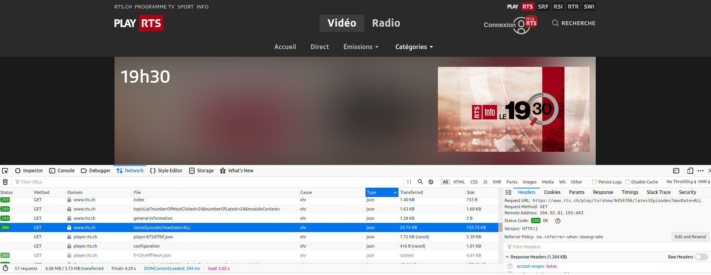

# Titres du 19h30

Nous allons collecter les titres des sujets du journal de 19h30 de la RTS. Le serveur n'est pas aussi généreux que celui de Galaxus, duquel nous avons tiré un [catalogue de chaussettes](../chaussettes_galaxus). Il va falloir être un plus ingénieux.

## Trouver la requête

En allant sur la [page du journal du jour](https://www.rts.ch/play/tv/emission/19h30?id=6454706) (le 15 Mars 2020), nous observons les requêtes que fait le navigateur (dans firefox `ctrl-shift-k` et l'onglet `network`).



La requête suivante semble intéressante:

[https://www.rts.ch/play/tv/show/6454706/latestEpisodes?maxDate=ALL](https://www.rts.ch/play/tv/show/6454706/latestEpisodes?maxDate=ALL)

En ouvrant l'URL dans un autre onglet du navigateur, nous voyons qu'elle retourne les 10 derniers épisodes du "19h30".


Et chaque épisode contient une séries de `segments`, les sujets du jour.


Essayons de changer la partie `maxDate`:

[https://www.rts.ch/play/tv/show/6454706/latestEpisodes?maxDate=2020-01-01](https://www.rts.ch/play/tv/show/6454706/latestEpisodes?maxDate=2020-01-01)

Il semble que cette requête nous permet de revenir dans le temps. À chaque `maxDate` nous pouvons obtenir les 10 épisodes précédents cette date.

## Télécharger les données

Nous allons utiliser la requête pour chercher les 10 derniers épisodes, puis les 10 derniers épisodes de 10 jours avant, puis les 10 derniers épisodes 10 jours avant ça... et ainsi de suite.

### Créer les dates `maxDate`

Pour manipuler les dates, nous allons utiliser la librairies [dayjs](https://github.com/iamkun/dayjs).

```
npm install dayjs --save
```

Une fonction pour trouver la prochaine date. 10 jours avant la précédente:

```js
const getNextMaxDate = maxDate =>
  (maxDate === 'ALL' ? dayjs() : dayjs(maxDate, 'YYYY-MM-DD'))
    .subtract(10, 'day')
    .format('YYYY-MM-DD')
```

Si `maxDate` est `ALL` (la première requête), nous prenons la date du jour (`dayjs()`). Si `maxDate` est une date au format `YYYY-MM-DD`, nous la passons à `dayjs` (`dayjs(maxDate, 'YYYY-MM-DD')`). Une fois que nous avons la date au format `dayjs`, nous pouvons y soustraire 10 jours (`.subtract(10, 'day')`) et la retourner au format souhaité (`.format('YYYY-MM-DD')`).

### Télécharger les derniers épisodes

Pour télécharger les données, nous utilisons `node-fetch`.

```
npm install node-fetch --save
```

Une fonction qui prends `maxDate`, fait la requête et lis la réponse au format `json`:

```js
const getLatestEpisodes = maxDate =>
  fetch(`https://www.rts.ch/play/tv/show/6454706/latestEpisodes?maxDate=${maxDate}`)
    .then(r => r.json())
```

### Sauver les données

Une fois les données obtenues, nous devons les sauver quelque part. Il est possible que notre scripte retourne une erreur tôt ou tard. Si nous gardons les résultat en mémoire pour créer un fichier à la fin, nous risquons de tout perdre en cas d'erreur. Il vaut mieux sauver les données à chaque fois que nous les obtenons.

Nous allons sauver les données dans un fichier [`ndjson`](http://ndjson.org/), (new line delimited json), c'est à dire un fichier où chaque ligne représente un objet `json`. À chaque fois que nous recevons des données du serveur de la RTS, nous ajouterons une ligne à ce fichier.

Nous utiliserons la librairie `fs`. Celle-ci est déjà installée avec `node`. Nous avons déjà utilisé les fonctions `readFile` et `writeFile` de `fs` pour respectivement lire et écrire un fichier entier. Cette fois nous souhaitons pouvoir ajouter une ligne à la fois à un fichier. Nous utiliserons la fonction [`createWriteStream`](https://nodejs.org/en/knowledge/advanced/streams/how-to-use-fs-create-write-stream/)

```js
const file = fs.createWriteStream('scraped.ndjson')

const saveLatest = latest =>
  file.write(`${JSON.stringify(latest)}\n`)
```

`file` est le fichier où nous sauvons les données. Il s'appellera `scraped.ndjson`. La fonction `saveLatest` prends un objet json (`latest`) et le converti en chaîne de caractères (`JSON.stringify`) et reviens à la ligne `\n`.

### Une boucle pour répéter l'opération

Nous avons ce qu'il nous faut pour télécharger les données pour une certaine date et pour sauver le résultat. Nous devons maintenant créer une boucle qui répète l'opération pour chaque nouvelle date.

---

### :point_up: Un example de boucle

Pour illustrer à quoi va ressembler notre boucle:

```js
const loop = (number, callback) => {
  if (number === 10) {
    return callback()
  }
  console.log(number)
  loop(number + 1, callback)
}
```

Dans cet example la fonction `loop` prends deux arguments: `number` (n'importe quel nombre) et `callback` (la fonction à appeler une fois la boucle terminée). Si `number` est égal à 10, nous appelons `callback`. Sinon nous loguons `number` et appelons `loop` à nouveau en incrémentant `number` de 1 (`loop(number + 1, callback)`).

Si nous lançons la boucle avec un `number` de 1:

```js
loop(1, () => console.log('done'))
```

`1` va être logué, `loop` va être appellé avec `2`, `2` va être logué, `loop` va être appellé avec `3`... et ainsi de suite jusqu'à ce que `loop` est appellé avec `10`. À ce moment là, la fonction `callback` va être appellée. Dans notre cas, `done` va être logué puisque notre `callback` est `() => console.log('done')`.

---

#### La boucle pour aller chercher tous les épisodes

Nous souhaitons continuer jusqu'à l'an 2000 si possible.

Une fonction pour décider quand il est temps d'arrêter:

```js
const loopShouldEnd = maxDate => {
  if (maxDate === 'ALL') { return false }
  return dayjs(maxDate, 'YYYY-MM-DD').isBefore('2000-01-01', 'YYYY-MM-DD')
}
```

Si `maxDate` est `ALL` (le premier tour), continuons. Si `maxDate` est avant `2000-01-01` arrêtons, sinon continuons.

La boucle:

```js
const loop = (maxDate, callback) => {
  if (loopShouldEnd(maxDate)) {
    // appeler callback si c'est le moment d'arrêter
    return callback()
  }
  // récupérer les épisodes
  getLatestEpisodes(maxDate)
    .then(latest => {
      // sauver les épisodes
      saveLatest(latest)
      // si "episodes" est vide arrêter la boucle
      if (R.propOr([], 'episodes', latest).length === 0) {
        return callback()
      }
      // générer la prochaine date
      const nextMaxDate = getNextMaxDate(maxDate)
      // loguer pour savoir où nous en sommes
      console.log(nextMaxDate)
      // appeler loop avec la nouvelle date
      // pour être gentil avec la RTS et pour ne pas se faire bannir de leur serveur,
      // attendons 1 seconde (1000 millisecondes) avant de continuer la boucle
      setTimeout(() => {
        loop(nextMaxDate, callback)
      }, 1000)
    })
    // arrêter la boucle s'il y a une erreur
    .catch(callback)
}
```

Lançons la boucle avec la première valeur (`ALL`). `callback` est une fonction qui prends un argument `err`. S'il y a une erreur, loguons-la, sinon loguons `done`.

```js
loop('ALL', err => console.log(err || 'done'))
```

Le script entier est [`scriptes/scrape.js`](scriptes/scrape.js), nous pouvons le lancer avec:

```
node scriptes/scrape.js
```

Après avoir tourné plusieurs minutes, le scripte s'est arrêté. Nous avons des épisodes jusqu'à l'an 2000. Il semble que les épisodes du 19h30 ne sont disponibles pour tous les jours qu'à partir de la fin 2001.

Nous avons presque 20 ans de titres du 19h30 dans `scraped.ndjson`. Le fichier est malheureusement trop grand pour être poussé sur github (~ 100Mb). Je l'ai ajouté à mon `.gitgnore`.

## Extraire les épisodes

Chaque ligne de `scraped.ndjson` contient 10 épisodes. Nous souhaitons avoir un fichier `ndjson` avec un épisode par ligne.

### Lire un fichier ligne par ligne

[`scriptes/extractEpisodes.js`](scriptes/extractEpisodes.js)

Pour lire le fichier `scraped.ndjson`, nous utilisons la librairie [`readline`](https://nodejs.org/api/readline.html#readline_readline_createinterface_options). Comme `fs`, celle-ci vient avec `node`, nous n'avons pas besoin de l'installer.

```js
const reader = readline.createInterface({
  input: process.stdin,
})

reader.on('line', line => {
  console.log(line)
})
```

La constante `reader` est un lecteur ligne par ligne qui prends tout texte venant de la console (`{ input: process.stdin }`).

Avec `reader.on` nous pouvons écouter les événements sur le lecteur. Dans ce cas quand une ligne est lue, nous la loguons. C'est à dire nous la renvoyons à la console.

Dans les cours précédents (pour les [données du graphique Gapminder](../rosling/data) par example) nous avons pris le texte de la console et l'avons sauver dans un fichier avec `>`. Par exemple pour sauver la requête des derniers épisodes du 19h30.

```
curl https://www.rts.ch/play/tv/show/6454706/latestEpisodes?maxDate=ALL > latest_19h30.json
```

Avec `<` nous pouvons faire l'inverse, passer un fichier à la console.

```
node scriptes/extractEpisodes < scraped.ndjson
```

Le fichier `scraped.ndjson` est passé à notre scripte qui le lit ligne par ligne et logue une ligne quand elle est lue.

Chaque ligne est une chaîne de caractères puisque c'est ainsi que nous l'avons sauvée en utilisant `JSON.stringify` plus haut. Nous pouvons convertir une ligne en `json` avec `JSON.parse`. `JSON.parse` transforme une chaîne de caractères en objet javascript, si c'est possible. C'est l'opération inverse de `JSON.stringify`.

```js
reader.on('line', line => {
  console.log(JSON.parse(line))
})
```

Nous avons maintenant accès à chaque ligne dans le scripte en tant qu'objet javascript.

Comme nous avons vu en analysant la réponse du serveur de la RTS, les épisodes sont sous la clé `episodes`. Plutôt que loguer chaque ligne, nous pouvons loguer chaque `episode`.

```js
reader.on('line', line => {
  const json = JSON.parse(line)
  json.episodes.map(episode => console.log(episode))
})
```

Si nous souhaitons sauver les épisodes dans un nouveau fichier, nous pouvons utiliser `>` pour sauver ce qui sort de la console dans un nouveau fichier. Mais avant cela nous devons transformer chaque épisode en chaîne de caractères avec `JSON.stringify`.

```js
reader.on('line', line => {
  const json = JSON.parse(line)
  json.episodes.map(episode => console.log(JSON.stringify(episode)))
})
```

```
node scriptes/extractEpisodes < scraped.ndjson > example_episodes.ndjson
```

`scraped.ndjson` est passé au scripte `extractEpisodes` qui passe chaque épisode à la console, qui à son tour les passe à `example_episodes.ndjson`.

`example_episodes.ndjson` n'est pas le fichier final. Nous allons profiter du fait d'avoir accès aux épisodes pour les transformer, n'en garder que les parties qui nous intéressent. Aussi pour avoir un fichier moins volumineux qui peut être poussé sur github, contrairement à `scrape.ndjson`

Pour chaque épisode nous souhaitons avoir:

* `episode_id` l'identifiant unique de l'épisode
* `date` la date de diffusion au format `YYYY-MM-DD`
* `duration` la durée de l'épisode en secondes
* `views` le nombre de vues
* `segments` les sujets traités. Pour chaque `segment`:
  - `segment_id` l'identifiant unique du `segment`
  - `title` le titre du sujet
  - `duration` la durée du sujet en secondes

Revenons à [https://www.rts.ch/play/tv/show/6454706/latestEpisodes?maxDate=ALL](https://www.rts.ch/play/tv/show/6454706/latestEpisodes?maxDate=ALL) pour voir à quoi ressemblent les épisodes.

### La date

Les dates peuvent avoir différents formats:
  - `Hier, 19h30`
  - `samedi, 19h30` (pour la semaine passée)
  - `06.03.2020, 19h30` (pour les épisodes plus anciens)

Si c'est un épisode plus ancien avec une date au format `DD.MM.YYYY`, nous la transformons simplement au format `YYYY-MM-DD`. Pour les dates plus récentes, je n'ai pas trouvé de meilleur moyen que de le faire "à la main". Attention, si vous souhaitez utiliser ce scripte à une autre date, `fixDate` doit être mis à jour.

```js
const dateOfDaysAgo = days => dayjs().subtract(days, 'day').format('YYYY-MM-DD')

const fixDate = date => {
  if (date.includes('Hier')) { return dateOfDaysAgo(1) }
  if (date.includes('samedi')) { return dateOfDaysAgo(2) }
  if (date.includes('vendredi')) { return dateOfDaysAgo(3) }
  if (date.includes('jeudi')) { return dateOfDaysAgo(4) }
  if (date.includes('mercredi')) { return dateOfDaysAgo(5) }
  if (date.includes('mardi')) { return dateOfDaysAgo(6) }
}

const getDate = ({ date }) => {
  const [day] = date.split(',')
  const [ d, m, y ] = day.split('.')
  if (!d || !m || !y) { return fixDate(date) }
  return `${y}-${m}-${d}`
}
```

* `dateOfDaysAgo` est une fonction qui prends un nombre et retourne la date d'il y a autant de jours.
* `fixDate` est la fonction qui récupère la date quand elle est en toutes lettres.
* `getDate` est une fonction qui prends un épisode et retourne la date au format `YYYY-MM-DD`.

### Les durées

Les durées des `episodes` et `segments` sont au format `MM:SS`, `28:32` par exemple.

```js
const durationInSeconds = duration => {
  const [m, s] = duration.split(':')
  return Number(m) * 60 + Number(s)
}
```

`durationInSeconds` transforme la durée en secondes.

### Les `segments`

Pour chaque `segment`, nous allons chercher `segment_id`, `title` et `duration`:

```js
const getSegments = ({ segments }) =>
  segments.map(segment => ({
    segment_id: segment.id,
    title: segment.title,
    duration: getDurationInSeconds(segment),
  }))
```

`getSegments` prends un épisode et retourne ce qui nous intéresse pour chaque `segment`.

### Les `episodes`

Pour chaque `episode`, nous prenons `episode_id`, `date`, `duration`, `segments` et `views`:

```js
const parseEpisode = episode => ({
  episode_id: episode.id,
  date: getDate(episode),
  duration: durationInSeconds(episode.duration),
  segments: episode.segments.map(parseSegment),
  views: episode.views,
})
```

### Lire chaque ligne

```js
reader.on('line', line => {
  const json = JSON.parse(line)
  json.episodes.map(R.pipe(
    parseEpisode,
    JSON.stringify,
    console.log
  ))
})
```

De chaque ligne, nous tirons tous les épisodes `json.episodes.map`. Nous transformons chaque épisode avec `parseEpisode`, le convertissons en chaîne de caractères avec `JSON.stringify` et le loguons avec `console.log`. `R.pipe` est la fonction [ramda](https://ramdajs.com/docs/#pipe) qui permet d'appliquer plusieurs fonctions à la suite.

```
npm install ramda --save
```

Sans utiliser `pipe`, nous pourrions écrire cette fonction comme ceci:

```js
reader.on('line', line => {
  const json = JSON.parse(line)
  json.episodes.map(episode =>
    console.log(
      JSON.stringify(
        parseEpisode(episode)
      )
    )
  )
})
```

La commande

```
node scriptes/extractEpisodes < latest.ndjson > episodes.ndjson
```

crée un fichier [`episodes.ndjson`](episodes.ndjson).

## Un fichier avec tous les sujets

Chaque ligne de `episodes.ndjson` est un épisode du 19h30, nous allons créer un fichier `segments.ndjson` avec tous les sujets traités. Comme avec `extractEpisodes`, nous allons lire le fichier ligne par ligne et en extraire ce qui nous intéresse.

Pour chaque sujet (`segment` pour utiliser l'appellation de l'API de la RTS), nous ajouterons:

* `episode_id`, pour pouvoir le lier à un épisode
* `position`, dans quelle position le `segment` a été diffuser (généralement les sujets considérés comme plus importants sont au début)
* et la `date`

[`scriptes/extractSegments.js`](scriptes/extractSegments.js)

```js
const readline = require('readline')
const R = require('ramda')

const reader = readline.createInterface({
  input: process.stdin,
})

reader.on('line', line => {
  const episode = JSON.parse(line)
  const { episode_id, date } = episode
  episode.segments.map(R.pipe(
    (d, i) => ({ ...d, position: i + 1 }),
    R.mergeRight({ episode_id, date }),
    JSON.stringify,
    console.log
  ))
})
```

Le lecteur `reader` est le même que tout à l'heure.

À chaque ligne nous allons prendre `episode_id` et `date` de l'épisode (`const { episode_id, date } = episode`).

Pour chaque segment (`episode.segments.map`), nous utilisons [R.pipe](https://ramdajs.com/docs/#pipe) pour appliquer une série de fonctions:

* Nous ajoutons la `position` qui est l'indexe du segment plus 1, pour que le premier titre ait une `position` de 1 plutôt que 0 (`(d, i) => ({ ...d, position: i + 1 })`).
* Nous ajoutons `episode_id` et `date` avec la fonction ramda [`mergeRight`](https://ramdajs.com/docs/#mergeRight) (`R.mergeRight({ episode_id, date })`)
* Nous transformons l'objet en chaîne de caractères (`JSON.stringify`)
* et loguons (`console.log`).

La commande pour faire tourner le scripte

```
node scriptes/extractSegments < episodes.ndjson > segments.ndjson
```

Les segments seront dans un fichier `segments.ndjson`
