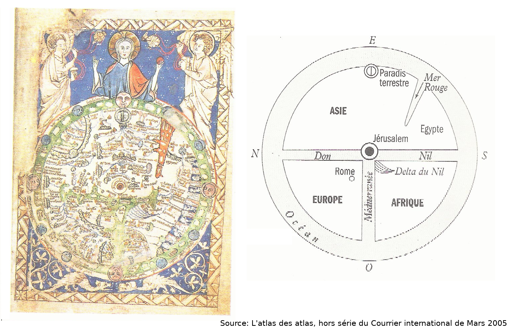

# La cartographie

## Définition

* `carta` (latin)

1. feuille de papyrus, papier
2. lettre, écrit
3. (poétique) livre
4. lamelle, feuille de métal

[grand-dictionnaire-latin.com](https://www.grand-dictionnaire-latin.com/dictionnaire-latin-francais.php?parola=carta)

* `-graphe`

> Du grec ancien γράφω grapho (« j’écris »), ou γράφειν graphein (« écrire »)

[wiktionary](https://fr.wiktionary.org/wiki/-graphe)

* `carte géographique`

> Une carte géographique est une représentation d'un espace géographique.

[wikipedia](https://fr.wikipedia.org/wiki/Carte_g%C3%A9ographique)

## Historique

Avant l'aviation et les satellites, il était impossible de voir la terre de dessus. Malgré cela on a essayé de représenter le monde autour de nous depuis la nuit des temps.

*Autour de nous* est le maître-mot. Ceci est une carte babylonienne du Ve siècle avant J.C.

Babylone est au milieu de la carte. C'est un réflexe naturel de se mettre au milieu quand on essaie de représenter le monde. 7000 ans plus tard, c'est encore le cas.

La difficulté principale de la cartographie est de représenter une sphère, la terre, sur une surface plane, une feuille de papier ou un écran. Le grec [Ptolémée](https://fr.wikipedia.org/wiki/G%C3%A9ographie_(Ptol%C3%A9m%C3%A9e)) réfléchissait déjà au problème au deuxième siècle. C'est lui qui popularisât les notions de **système de coordonnées** (représenter un point sur une sphère par sa latitude et longitude) et de **projections** (les différentes manières de "projeter" une sphère sur une surface plane).

### Moyen-Âge

En Europe au Moyen-Âge, la religion avait une place prépondérante dans la vision du monde. Il était commun de représenter le monde avec Jérusalem au centre. Ce sont les cartes en **TO**.

Ces cartes sont appellées ainsi parce qu'elles ressemblent à un T à l'intérieur d'un O. Les trois parties du T représentent le Don, le Nil et la Méditerranée qui séparent l'Europe, l'Asie et l'Afrique.

L'orient est en haut de la carte. Il est possible que ce soit l'origine du mot "orientation", utilisé pour décrire dans quelle direction la carte pointe.

Le monde islamique, alors à son apogée, avait non seulement gardé les écrits grecs, tels que la Géographie de Ptolémée. Mais avait aussi, du fait de la taille de son empire, une plus vaste connaissance du monde.

Cette carte qui date de la même époque que la carte en TO européenne. Bien qu'approximative, elle est une tentative de représenter le monde de manière exacte plutôt que symbolique. L'orientation de cette carte est avec le Sud vers le haut de la carte. Dans la plupart des cartes d'aujourd'hui le Nord est vers le haut. Pour nous elle est à l'envers.

### Mercator

Pendant le [siècle d'or](https://fr.wikipedia.org/wiki/Si%C3%A8cle_d%27or_n%C3%A9erlandais), les néerlandais partent à la découverte du monde. Un monde qu'il vaut mieux cartographier pour savoir où on est. Et où on va. C'est alors que [Gérard Mercator](https://fr.wikipedia.org/wiki/G%C3%A9rard_Mercator) invente la projection qui porte son nom.

Cette projection est idéale pour la navigation puisqu'elle conserve les angles par rapport à la latitude. En sortant du port il est possible de calculer le bon cape pour arriver à destination. Il suffira de garder ce cape tout au long du voyage. La projection Mercator est encore le standard utilisé pour la plupart des cartes de nos jours.

Le problème de la projection de Mercator est que les surfaces des terres sont déformées. Plus nous approchons des pôles, plus elles paraissent grandes. Tous les points sur la carte qui suit sont de la même taille sur une sphère.

Le site [The true size](https://thetruesize.com) permet de déplacer un pays vers d'autres latitudes pour comparer sa taille à d'autres pays. Et pour se rendre compte de la déformation.

### Alternatives à Mercator

Dans les années 1970 [Arno Peters](https://en.wikipedia.org/wiki/Arno_Peters), considérait que la projection Mercator était "eurocentrique". Comme elle représentait les régions plus proches des pôles plus grandes qu'elles ne le sont, l'Europe y prends trop de la place. Il créa sa propre projection où chaque terre est certes déformée mais correspond à sa taille réelle.

D'autres n'ayant pas de problème avec la taille des terres mais avec le positionnement de la carte, ont créé des projections où l'Europe n'est plus au centre.

Comme cette carte japonaise.

Ou cette version australienne.

### Cartes politiques

Représenter le monde est un acte politique. Et pas seulement dans le choix de la projection.

Cette carte japonaise a été conçue pour justifier sa [guerre contre la Russie en 1904](https://fr.wikipedia.org/wiki/Guerre_russo-japonaise).

Voici un exemple plus récent représentant le monde d'après le groupe "État islamique".

Elle ne représente pas des pays existants mais les régions d'un califat imaginaire.

### Un consensus difficile

Il est impossible de représenter le monde de manière à ce que tout le monde soit d'accord.

L'ONU, un organisme censé représenter tous les pays du monde, a choisi une projection avec le pôle Nord au centre pour son drapeau. Personne n'est correctement représenté, personne n'est lesé.

Dans le contexte de l'[annexion de la Crimée](https://fr.wikipedia.org/wiki/Crise_de_Crim%C3%A9e) par la Russie en 2014, comment faut-il représenter cette partie du monde sur une carte?

Google maps a choisi de montrer la Crimée faisant partie de la Russie [à ses clients russes](https://www.theguardian.com/technology/2014/apr/22/google-maps-russia-crimea-federation). Et faisant partie de l'Ukraine pour le reste du monde.

Ceci n'est pas possible pour le jeu de données collaboratif de [Open Street Map](https://fr.wikipedia.org/wiki/OpenStreetMap). C'est le même jeu de données pour tout le monde. D'après la [discussion sur le forum](https://help.openstreetmap.org/questions/35048/why-crimea-is-in-russian-federation), il a été décidé d'appliquer la règle dite de ["On the ground rule"](https://wiki.openstreetmap.org/wiki/Disputes#On_the_Ground_Rule). La réalité sur le terrain est ce qui décide plutôt que la situation légale. La Crimée y fait partie de la Russie.