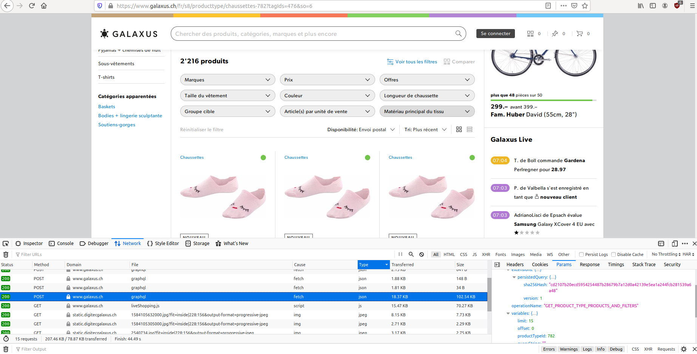

# Récupérer tous les modèles de chaussettes

Que ce soit pour un travail journalistique, ou tout simplement pour voir les prix de la concurrence, supposons que les prix des chaussettes chez Galaxus nous intéressent.

## Trouver la requête

Dans la console développeur du navigateur (`ctrl-shift-k` sur firefox), allons dans l'onglet `network`.Puis ouvrons la [page liée aux chaussettes](https://www.galaxus.ch/fr/s8/producttype/chaussettes-782).

Même avec un bloqueur de publicité, le navigateur fait 69 requêtes en ouvrant cette page. Il y a pas mal de photos, nous pouvons les ignorer. Ce qui nous intéresse ce sont les requêtes qui retournent du `json`. Il y en a quelque-unes et il va falloir aller voir ce que chacune d'elles fait. C'est généralement une bonne idée de commencer avec celles qui retournent le plus de données.



Une fois la requête trouvée, je fais un click droit dessus et `Copy > Copy as cURL`

```
curl 'https://www.galaxus.ch/api/graphql' -H 'User-Agent: Mozilla/5.0 (X11; Ubuntu; Linux x86_64; rv:74.0) Gecko/20100101 Firefox/74.0' -H 'Accept: */*' -H 'Accept-Language: fr-CH' --compressed -H 'Referer: https://www.galaxus.ch/fr/s8/producttype/chaussettes-782?tagIds=476' -H 'content-type: application/json' -H 'X-Dg-Portal: 22' -H 'X-Dg-Mandator: 406802' -H 'X-Dg-Country: ch' -H 'X-Dg-Userid: null' -H 'X-Dg-LoginStatus: loggedOut' -H 'X-Dg-CustomerType: standard' -H 'X-Dg-SessionZ: T39MoVBmuAGhzOiLCpydKA==' -H 'X-Dg-TestGroup: undefined' -H 'X-Dg-BuildId: 307177' -H 'X-Dg-ScrumTeam: StellaPolaris' -H 'X-Dg-RouteName: productTypeOverview' -H 'X-Dg-Correlation-Id: 0ad2988e-aaa7-43f3-8aac-c467b99ad75e' -H 'Origin: https://www.galaxus.ch' -H 'DNT: 1' -H 'Connection: keep-alive' -H 'TE: Trailers' --data '[{"operationName":"GET_PRODUCT_TYPE_PRODUCTS_AND_FILTERS","variables":{"productTypeId":782,"queryString":"","offset":0,"limit":15,"sort":"BESTSELLER","siteId":null,"sectorId":8},"extensions":{"persistedQuery":{"version":1,"sha256Hash":"cd2107b20ecd5954254487b28679b7a12d0a42139e5ea1a244fcb281539a6a48"}}}]'
```

C'est une requête [GraphQL](https://fr.wikipedia.org/wiki/GraphQL), une convention pour intéragir avec un serveur comme les [API REST](https://fr.wikipedia.org/wiki/Representational_state_transfer) discutées lors du [cours du 6 Mars](../../2020-03-06.md#api-rest). Le `QL` veut dire "Query Language", comme dans `SQL`.

Avec les API REST les requêtes sont organisées en URL par "ressource", par example:

* `https://mon-serveur.com/api/users`
* `https://mon-serveur.com/api/products`

Avec GraphQL l'URL est toujours la même. Dans ce cas: `https://www.galaxus.ch/api/graphql`. Vous obtenez différentes données en formulant une requête dans le message que vous envoyez au serveur. Dans notre requête pour les chaussettes, nous pouvons le voir sous `--data` à la fin de la requête. C'est un `json` qui ressemble à ça:

```js
[
  {
    "operationName":"GET_PRODUCT_TYPE_PRODUCTS_AND_FILTERS",
    "variables":{
      "productTypeId":782,
        "queryString":"",
        "offset":0,
        "limit":15,    // <-- ici
        "sort":"BESTSELLER",
        "siteId":null,
        "sectorId":8
    },
    "extensions":{
      "persistedQuery":{
        "version":1,
        "sha256Hash":"cd2107b20ecd5954254487b28679b7a12d0a42139e5ea1a244fcb281539a6a48"
      }
    }
  }
]
```

La partie intéressante est la limite du nombre de produits retournés, `"limit": 15`. 15 produits sont affichés sur la page. On y voit aussi qu'il y a un peu plus de 2200 produits pour cette catégorie. Essayons de changer la limite à 2300 et sauvons le fichier en tant que [`chaussettes.json`](chaussettes.json):

```
curl 'https://www.galaxus.ch/api/graphql' -H 'User-Agent: Mozilla/5.0 (X11; Ubuntu; Linux x86_64; rv:74.0) Gecko/20100101 Firefox/74.0' -H 'Accept: */*' -H 'Accept-Language: fr-CH' --compressed -H 'Referer: https://www.galaxus.ch/fr/s8/producttype/chaussettes-782?tagIds=476' -H 'content-type: application/json' -H 'X-Dg-Portal: 22' -H 'X-Dg-Mandator: 406802' -H 'X-Dg-Country: ch' -H 'X-Dg-Userid: null' -H 'X-Dg-LoginStatus: loggedOut' -H 'X-Dg-CustomerType: standard' -H 'X-Dg-SessionZ: T39MoVBmuAGhzOiLCpydKA==' -H 'X-Dg-TestGroup: undefined' -H 'X-Dg-BuildId: 307177' -H 'X-Dg-ScrumTeam: StellaPolaris' -H 'X-Dg-RouteName: productTypeOverview' -H 'X-Dg-Correlation-Id: 0ad2988e-aaa7-43f3-8aac-c467b99ad75e' -H 'Origin: https://www.galaxus.ch' -H 'DNT: 1' -H 'Connection: keep-alive' -H 'TE: Trailers' --data '[{"operationName":"GET_PRODUCT_TYPE_PRODUCTS_AND_FILTERS","variables":{"productTypeId":782,"queryString":"","offset":0,"limit":15,"sort":"BESTSELLER","siteId":null,"sectorId":8},"extensions":{"persistedQuery":{"version":1,"sha256Hash":"cd2107b20ecd5954254487b28679b7a12d0a42139e5ea1a244fcb281539a6a48"}}}]' \
> chaussettes.json
```

## Préparer les données

Voyons ce que contient notre fichier. Créons un scripte [`prepare.js`](prepare.js) où nous chargeons `chaussettes.json` et `ramda`:

```js
const data = require('./chaussettes.json')
const R = require('ramda')

console.log(data)
```

C'est un gros `json`, il va falloir utiliser [`path` de `ramda`](https://ramdajs.com/docs/#path) pour trouver ce que nous cherchons. Après quelques essais, j'ai trouver la liste des produits en suivant ce chemin:

```js
const products = R.path([0, 'data', 'productType', 'filterProductsV4', 'products', 'results'], data)

console.log(products)
```

Je ne sais pas comment font les développeurs de cette application. C'est pas du gâteau. Un produit ressemble à ça:

```js
{
  id: 'PROD10408706___',
  productIdAsString: '10408706',
  productTypeIdAsString: '782',
  productTypeName: 'Chaussettes',
  imageUrl: 'https://static.digitecgalaxus.ch/Files/3/2/0/3/1/1/3/3/Tommy%20Hilifger%20Classic%20Socken%206%20Pack.jpeg?fit=inside%7C384:260',
  imageSet: [
    {
      alternateText: null,
      source: 'https://static.digitecgalaxus.ch/Files/3/2/0/3/1/1/3/3/Tommy%20Hilifger%20Classic%20Socken%206%20Pack.jpeg?fit=inside%7C384:260',
      __typename: 'ImageSetItem'
    },
    {
      alternateText: null,
      source: 'https://static.digitecgalaxus.ch/Files/1/8/8/2/7/3/0/3/371111-200ab-PP%20002.jpg?fit=inside%7C384:260',
      __typename: 'ImageSetItem'
    },
    {
      alternateText: null,
      source: 'https://static.digitecgalaxus.ch/Files/1/8/8/2/7/3/1/5/TH.jpg?fit=inside%7C384:260',
      __typename: 'ImageSetItem'
    }
  ],
  sectorId: '8',
  name: 'Classic',
  brandId: '4510',
  brandName: 'Tommy Hilfiger',
  fullName: 'Tommy Hilfiger Classic',
  simpleName: 'Classic',
  nameProperties: '6Paar, 43, 44, 45, 46',
  productConditionLabel: '',
  marketingDescription: null,
  pricing: {
    supplierId: null,
    secondHandSalesOfferId: null,
    price: {
      amountIncl: 39.7,
      amountExcl: 36.86,
      fraction: 0.077,
      currency: 'CHF',
      __typename: 'VatMoney'
    },
    priceRebateFraction: null,
    insteadOfPrice: null,
    volumeDiscountPrices: [],
    __typename: 'Pricing'
  },
  availability: {
    icon: 'FULLGREENEXTRA',
    mail: {
      siteId: '',
      title: 'Envoi postal',
      type: 'STOCK',
      icon: 'FULLGREENEXTRA',
      text: 'Plus de 10 pièce(s) prête(s) à être envoyée(s) depuis notre entrepôt',
      description: 'Date de livraison prévue: Vendredi 03.04.2020, si commandé avant demain 19:00 heures',
      tooltipDescription: 'Plus de 10 pièce(s)\r\ndans notre entrepôt',
      deliveryDate: '2020-04-02T22:00:00.0000000Z',
      __typename: 'Mail'
    },
    pickup: {
      title: '',
      notAllowedText: '',
      description: '',
      isAllowed: false,
      __typename: 'Pickup'
    },
    pickMup: {
      description: 'Plus de 10 pièce(s)',
      isAllowed: true,
      __typename: 'PickMup'
    },
    sites: null,
    isFloorDeliveryAllowed: false,
    __typename: 'Availability'
  },
  energyEfficiency: {
    energyEfficiencyColorType: null,
    energyEfficiencyLabelText: null,
    energyEfficiencyLabelSigns: null,
    energyEfficiencyImageUrl: null,
    __typename: 'EnergyEfficiency'
  },
  salesInformation: null,
  showroomSites: [],
  rating: 4.6,
  totalRatings: 16,
  totalQuestions: 0,
  isIncentiveCashback: false,
  incentiveText: null,
  isNew: false,
  isBestseller: false,
  isProductSet: false,
  isSalesPromotion: false,
  isComparable: true,
  isDeleted: false,
  isHidden: false,
  canAddToBasket: true,
  hidePrice: false,
  germanNames: {
    germanProductTypeName: 'Socken',
    nameWithoutProperties: 'Classic',
    germanProductNameProperties: '6Paar, 43, 44, 45, 46',
    germanNameWithBrand: null,
    __typename: 'GermanNames'
  },
  productGroups: {
    productGroup1: 158,
    productGroup2: 383,
    productGroup3: null,
    productGroup4: 751,
    __typename: 'ProductGroups'
  },
  isOtherMandatorProduct: false,
  lowQualityImagePlaceholder: 'data:image/jpg;base64,/9j/4AAQSkZJRgABAQAAAQABAAD/2wCEABALDA4MChAODQ4SERATGCgaGBYWGDEjJR0oOjM9PDkzODdASFxOQERXRTc4UG1RV19iZ2hnPk1xeXBkeFxlZ2MBERISGBUYLxoaL2NCOEJjY2NjY2NjY2NjY2NjY2NjY2NjY2NjY2NjY2NjY2NjY2NjY2NjY2NjY2NjY2NjY2NjY//AABEIADIAMAMBIgACEQEDEQH/xAGiAAABBQEBAQEBAQAAAAAAAAAAAQIDBAUGBwgJCgsQAAIBAwMCBAMFBQQEAAABfQECAwAEEQUSITFBBhNRYQcicRQygZGhCCNCscEVUtHwJDNicoIJChYXGBkaJSYnKCkqNDU2Nzg5OkNERUZHSElKU1RVVldYWVpjZGVmZ2hpanN0dXZ3eHl6g4SFhoeIiYqSk5SVlpeYmZqio6Slpqeoqaqys7S1tre4ubrCw8TFxsfIycrS09TV1tfY2drh4uPk5ebn6Onq8fLz9PX29/j5+gEAAwEBAQEBAQEBAQAAAAAAAAECAwQFBgcICQoLEQACAQIEBAMEBwUEBAABAncAAQIDEQQFITEGEkFRB2FxEyIygQgUQpGhscEJIzNS8BVictEKFiQ04SXxFxgZGiYnKCkqNTY3ODk6Q0RFRkdISUpTVFVWV1hZWmNkZWZnaGlqc3R1dnd4eXqCg4SFhoeIiYqSk5SVlpeYmZqio6Slpqeoqaqys7S1tre4ubrCw8TFxsfIycrS09TV1tfY2dri4+Tl5ufo6ery8/T19vf4+fr/2gAMAwEAAhEDEQA/AO/JAGScCgMDjBHIyK5D4gQyCK1uFkcR5MbqGO3PUHH51m+B5nbXSJHZi0DKNxz0IoA6bxF4gOiGJRamUyqSrFsKCO1Q6D4nOsX/ANm+zCICIuW3ZyQR29Oaj8eQq+ixyn70Uwx+IINcz4PuFt/EEO9sLIGjz7np+ooA6Lx39pisreaCeWOPeUkVWIByOM/kfzrG8G3c8mvwpNPI6iJkVWYkAAdvyrofHEsaaAyPjfJIoQe4Of5CuI0S6ks9Xtp4o2kZXxsXqwPBA/OgDsvHs8aaRFASPMklBUewByf8+tcl4cnng1y1e3jMjl9pUd1PB/Tmuw13R9Elcy3t2beZmyWM2WPsAc8fSpPD+kaVYXkz2N39pmVQrZZW2A/T6UAUPGKareokMVhJ9mSTO5CHLnscDoOtZXhvw7c3GpK99bzQQw/OdyldxzwBW74o8Q3ukXSQW8MW2RNwkfJ78jH+etP8M+ILnWbu4SeOONEQMoTPrzk0AP1/QbG9zPd38kDZyGkkyqjuAD0qDw/oem2GoLNDqCXUxjJjTjIB/iwD/nNR+P7QSWFvdgfNE+w/Rv8A64H51heCXCeIoh/eR1/TP9KAND4gWgS6trtR/rFMbfUcj+Z/Km/D5wL67j/vRA/kf/r0/wAeajBObe0gkSRoyXcqc7ewH86zfBsd02uRvbD5EB84npsP+eKANz4gxobKzkON4lKj6Ec/yFY/gi7S21vy5DgToYwffII/lWp4o0rXNTmiYRQvEmQiRP8Ad9zuxz9KTwt4Znt703WpQbDFjylLA5b149KALfjm/hj0oWYdWmlcfKDyAOcn9K4/Q1um1e2Niu6cPlfTHfPtivR73QtNvtxntIyzNuZ1G1ifcjmk07Q9P0yZprSDZIy7SSxPH40Ac346tbeD7F5MEUe4vnYgGenpVrwCqi0uyAATIozj2o8AqotLsgAEyKM49qPAKqLS7IABMijOPagDrKKKKACiiigD/9k=',
  __typename: 'Product'
}
```

L'intérêt du GraphQL est de faire des requête pour n'avoir que ce dont on a besoin. Ici j'ai l'impression de demander la base de données un entier. Prenons ce qui nous intéresse.

Une fonction pour sortir l'identifiant unique, le nom du produit, la marque, la description et le prix (TVA incluse): 

```js
const getProductData = R.pipe(
  R.pick(['id', 'name', 'brandName', 'nameProperties', 'pricing']),
  d => ({ ...d, price: R.path(['price', 'amountIncl'], d.pricing) }),
  R.omit(['pricing'])
)
```

Pour sauver le résultat:

```js
console.log(
  JSON.stringify(
    products.map(getProductData)
  )
)
```

Pour créer un fichier [`data.json`](data.json):

```
node prepare > data.json
```

## Conclusion

Nous sommes maintenant les heureux propriétaires de tout le catalogue des chaussettes vendues sur Galaxus. Je doute qu'il y ait quelque chose d'intéressant à en tirer, à moins d'être dans le business de la chaussette.

Ce qu'il y a à retenir est que si des données vous intéressent mais ne sont pas disponibles en "open data", il y a peut être un moyen de les trouver quand même. Si elles sont affichées sur une page web, elles existent et devraient être accessibles. Regardez les requêtes que fait le navigateur, essayez de les reproduire avec `curl` et modifiez les pour avoir ce que vous souhaitez.
