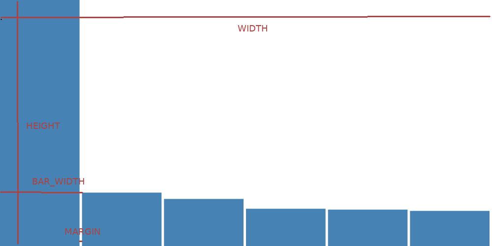

# Graphique en bâtons - 1ère partie

## Mise en place

Pour des examples de mise en place de projets web, voyez les [recettes](../recettes/readme.md).

Nous avons un dossier [`src`](src) avec deux fichiers:
* Un fichier HTML [`index.html`](src/index.html)
* Un fichier javascript [`index.js`](src/index.js)

Le scripte dans `package.json`:

```js
{
  // ...
  "scripts": {
    "batons:1": "parcel modules/graphique_batons_1/src/index.html --out-dir modules/graphique_batons_1/dist",
    // ...
  },
  // ...
}
```

La commande pour lancer le serveur de dévélopement

```
npm run batons:1
```

## `index.html`

```html
<!DOCTYPE html>
<html>
  <body>
    <script src="index.js"></script>
  </body>
</html>s
```

## `index.js`

Commençons par importer `d3` et définir les données.

```js
import * as d3 from 'd3'

const DATA = [
  { nom: 'Lausanne', population: 138905 },
  { nom: 'Yverdon-les-Bains', population: 30143 },
  { nom: 'Montreux', population: 26574 },
  { nom: 'Renens', population: 21036 },
  { nom: 'Nyon', population: 20533 },
  { nom: 'Vevey', population: 19827 },
]
```

Définissons les dimensions du graphique

```js
const WIDTH = 1000
const HEIGHT = 500
const MARGIN = 5
const BAR_WIDTH = WIDTH / DATA.length
```



Ajouter un élément `<svg>` au corps du HTML

```js
const svg = d3.select('body')
  .append('svg')
  .attr('width', WIDTH)
  .attr('height', HEIGHT)
```

Une échelle pour avoir la hauteur des bâtons en fonction de la valeur `population`

```js
const yScale = d3.scaleLinear()
  .domain([0, d3.max(DATA, d => d.population)])
  .range([HEIGHT, 0])
```

Nous utilisons la fonction [`scaleLinear`](https://github.com/d3/d3-scale#linear-scales) de `d3`. Les valeurs en entrées vont de 0 au maximum de population, 138905. Les valeurs en sortie vont de la hauteur du graphique à 0.

Lier les données `DATA` à des éléments `<rect>`

```js
// selectionner les "rect" qui n'existent pas encore
svg.selectAll('rect')
  // lier les données à ces "rect"s
  .data(DATA)
  // quand une donnée entre...
  .enter()
  // ...ajouter un élément "rect"
  .append('rect')
  // "x" correspond à l'indexe de la valeur multiplié par BAR_WIDTH
  .attr('x', (d, i) =>  i * BAR_WIDTH)
  // "width" correspond à BAR_WIDTH moins la marge entre les bâtons
  .attr('width', BAR_WIDTH - MARGIN)
  // "y" est défini en passant la population à "yScale"
  .attr('y', d => yScale(d.population))
  // "height" est la hauteur du graphique moins "y"
  .attr('height', d => HEIGHT - yScale(d.population))
  // la couleur des bâtons
  .attr('fill', 'steelblue')
```

Avec `d3`, les attributs peuvent être définis en fonction des données auxquelles l'élément est joint. `y` est défini en fonction de l'échelle `yScale`. Nous devons passer la clé `population` à l'échelle pour calculer la position `y` de chaque élément: `d => yScale(d.population)`.

Dit autrement, la valeur d'un attribut peut être défini par une fonction qui prends la donnée liée à cet élément en premier argument. Nous appellons cette donnée `d`. Le deuxième argument est l'indexe, appellé `i` ici. Ce dernier représente la position d'un élément par rapport aux autres. Nous l'utilisons pour l'attribut `x` pour que le premier ait `0 * BAR_WIDTH` , le deuxième, `1 * BAR_WIDTH`, le troisième, `2 * BAR_WIDTH`... et ainsi de suite.

