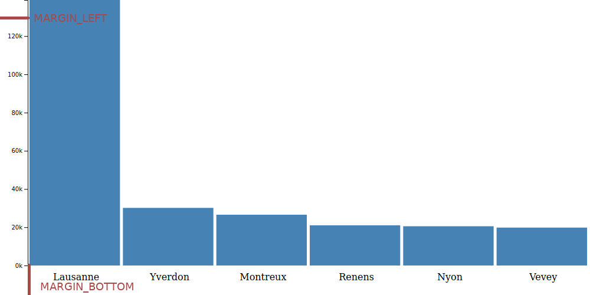

# Ajouter des axes à un graphique en bâtons

Nous avions commencé à créer un [graphique en bâtons la semaine dernière](../graphique_batons_1/readme.md). Pour l'instant nous n'avons que les bâtons, pas d'explications sur ce qu'ils signifient.

Reprenons le code que nous avons déjà dans `index.js`

```js
import * as d3 from 'd3'

const DATA = [
  { nom: 'Lausanne', population: 138905 },
  { nom: 'Yverdon-les-Bains', population: 30143 },
  { nom: 'Montreux', population: 26574 },
  { nom: 'Renens', population: 21036 },
  { nom: 'Nyon', population: 20533 },
  { nom: 'Vevey', population: 19827 },
]

const WIDTH = 1000
const HEIGHT = 500
const MARGIN = 5
const BAR_WIDTH = WIDTH / DATA.length

const svg = d3.select('body')
  .append('svg')
  .attr('width', WIDTH)
  .attr('height', HEIGHT)

const yScale = d3.scaleLinear()
  .domain([0, d3.max(DATA, d => d.population)])
  .range([HEIGHT, 0])

svg.selectAll('rect')
  .data(DATA)
  .enter()
  .append('rect')
  .attr('x', (d, i) =>  i * BAR_WIDTH)
  .attr('width', BAR_WIDTH - MARGIN)
  .attr('y', d => yScale(d.population))
  .attr('height', d => HEIGHT - yScale(d.population))
  .attr('fill', 'steelblue')
```

## Faire de la place pour les axes

Ajouter des marges à gauche et en bas.

```js
const MARGIN_LEFT = 50
const MARGIN_BOTTOM = 50
const BAR_WIDTH = (WIDTH - MARGIN_LEFT) / DATA.length
```



Mettre à jour `BAR_WIDTH` et `yScale`

```js
const BAR_WIDTH = (WIDTH - MARGIN_LEFT) / DATA.length

const yScale = d3.scaleLinear()
  .domain([0, d3.max(DATA, d => d.population)])
  .range([HEIGHT - MARGIN_BOTTOM, 0])
```

Créer un groupe pour contenir les bâtons et déplacer celui-ci sur la droite

```js
const batons = svg.append('g')
  .attr('transform', `translate(${MARGIN_LEFT}, 0)`)

batons.selectAll('rect')
  .data(DATA)
  .enter()
  .append('rect')
  .attr('x', (d, i) =>  i * BAR_WIDTH)
  .attr('width', BAR_WIDTH - MARGIN)
  .attr('y', d => yScale(d.population))
  .attr('height', d => HEIGHT - MARGIN_BOTTOM - yScale(d.population))
  .attr('fill', 'steelblue')
```

Plutôt qu'attacher les `<rect>` directement au `<svg>` nous les attachons au groupe `batons`. Nous ajustons également la hauteur, `height` pour qu'ils laissent de la place au dessous.

## Ajouter le nom des villes

```js
batons.selectAll('text')
  .data(DATA)
  .enter()
  .append('text')
  .text(d => d.nom)
  .attr('x', (d, i) =>  i * BAR_WIDTH + BAR_WIDTH / 2)
  .attr('y', HEIGHT - MARGIN_BOTTOM / 2)
  .attr('text-anchor', 'middle')
```

Nous créons des textes attachés au même groupe que les bâtons. Pour l'attribut `x`, c'est la même chose que pour les bâtons, simplement décalés avec la largeur d'un demi bâton. Pour qu'ils soient au milieu de chaque bâton.

## Ajouter l'axe vertical

```js
const axisY = d3.axisLeft().scale(yScale)
  .tickFormat(d => `${d / 1000}k`)
  .ticks(5)

svg.append('g')
  .attr('transform', `translate(${MARGIN_LEFT - 3})`)
  .call(axisY)
```

Nous passons l'échelle `yScale` à la fonction `d3.axisLeft` qui génére l'axe. Le résultat est appellé sur un nouveau groupe pour être ajouté au DOM.
