# Une visualisation n'est pas la réalité

Quand nous créons un graphique, nous montrons une version subjective de la réalité. Nous avons choisi quelles données utiliser, comment les transformer et comment les représenter.

Pourtant les visualisations sont souvent perçues comme quelque chose de sérieux. Presque scientifique. Et il existe plusieurs manières d'abuser de cette perception.

## Mentir avec un graphique

Dans son livre [How charts lie](http://www.thefunctionalart.com/2019/10/how-charts-lie-few-corrections.html), le journaliste [Alberto Cairo](http://albertocairo.com/) démontre différentes manières de mentir avec un graphique.

### Mentir en visualisant

#### Avortements ou prévention du cancer

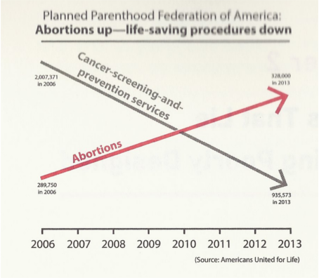

Le graphique ci-dessus a été présenté par un sénateur américain opposé à l'avortement. Il montre qu'entre 2006 et 2013, le nombre d'avortement a augmenté alors que les efforts de prévention du cancer ont baissés. Le sous-entendu étant que les moyens mis à disposition pour les avortements affectent négativement d'autres pratiques médicales plus importante.

Le graphique ne comporte pas d'échelle sur l'axe vertical. Mais si nous regardons les chiffres. La prévention du cancer est effectivement passée de près de 2 millions à un million. Les avortement ont eux augmenté de 290'000 à 328'000.

Dans sa version corrigée, Alberto Cairo ajoute une échelle et et redessine les courbes par rapport à celle-ci.

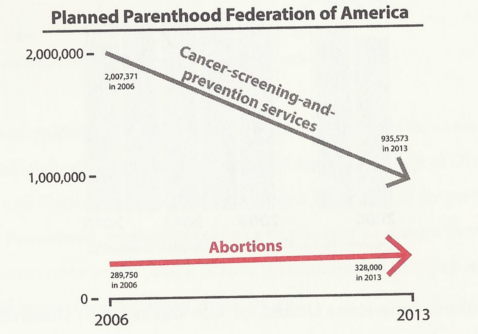

Quelle que soit la raison pour la baisse de prévention du cancer, elle peut difficilement être attribuée à l'augmentation des avortements.

#### Graphiques en 3D

Les graphiques en trois dimension sont rarement une bonne idée. À moins que le but soit d'embrouiller le lecteur. Un cas de figure imaginé par Cairo, est un rapport annuel. Dans lequel une entreprise fictive souhaite montrer des résultats plus positifs qu'ils ne le sont vraiment.

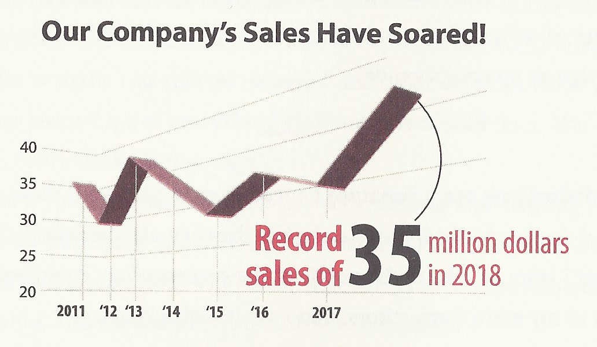

La version corrigée ne donne pas la même impression de succès.

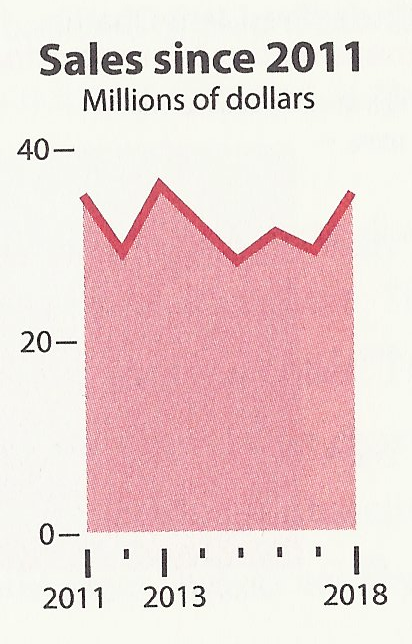

### Mentir en choisissant les données

#### Différences salariales

Cairo cite un [article de la BBC](https://www.bbc.com/news/business-43156286), selon lequel les femmes gagnent 43% de moins que les hommes à la banque Barclays. Le chiffre n'est pas un mensonge en soit. Mais le titre sous-entends qu'il est question de différences de salaires pour une même position.

Le répartition des employés en catégories salariales et par sexe:

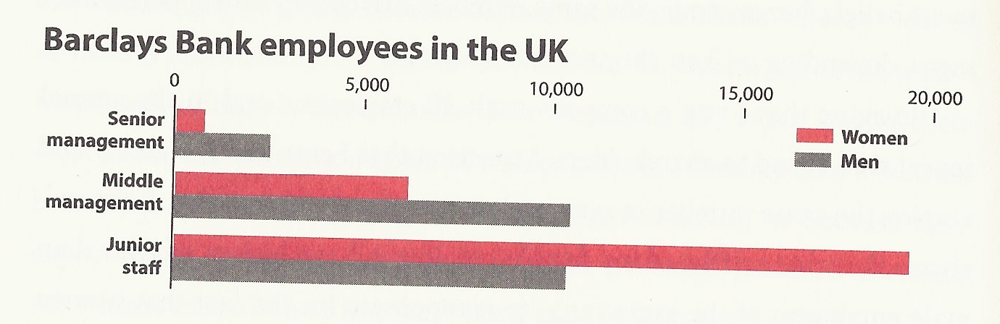

Les femmes ne sont pas payées moins que les hommes pour le même boulot. Ce pourrait être le cas mais ces données ne nous disent rien là dessus. En revanche ce que nous disent les données est que plus de femmes travaillent dans des rôles "junior". Moins bien payés que les postes de direction, où les hommes sont majoritaires.

Le "mensonge" de l'article est le fait de parler de différences hommes-femmes au niveau du salaire plutôt qu'au niveau des chances d'avoir un poste mieux rémunéré.

#### Consomation de porno et politique

Dans le contexte très polarisé de la polique aux Etats-Unis, tous les moyens sont bons pour discréditer l'adversaire. La consomation de pornographie en est un.

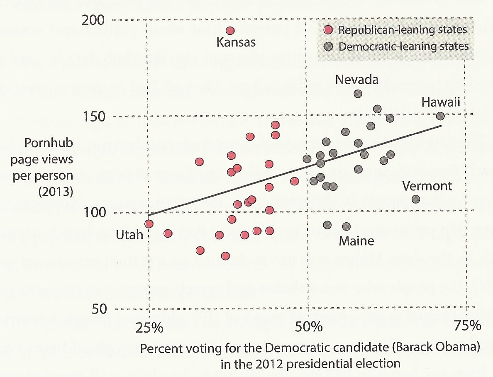

D'après le graphique ci-dessus les états qui ont voté Obama en 2012 ont vu plus de pages sur PornHub que les états républicains. Une exception: le Kansas, état républicain qui a de loin le plus de vues sur PornHub.

Comme discuté lors de la présentation de "PornHub insights", ceci ne dit rien sur le Kansas. PornHub géolocalise ses utilisateurs en fonction de leur adresse IP. Et il se trouve que le Kansas est pile au centre du pays.

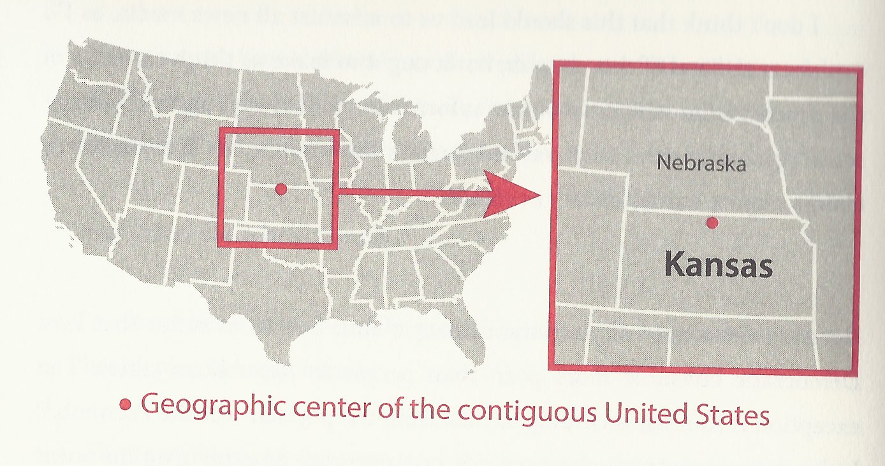

Si l'adresse IP d'un utilisateur se situe "quelque part aux Etats-Unis", PornHub va imaginer qu'il est au Kansas.

Ceci ne contredit en rien la thèse du graphique. Au contraire, si le Kansas républicain ne consomme pas autant de pages PornHub qu'il n'y parait, la tendance est encore plus favorable à la théorie: les démocrates sont plus vicelards.

Non seulement les données de PornHub sont potentiellement inexactes, utiliser les vues sur ce site pour représenter la consomation de pornographie est réducteur. Il existe d'autres moyens de consommer de la pornographie.

Pour contrer le graphique au-dessus, un partisan démocrate a créé un graphique démontrant qu'au contraire, les républicains consomment plus de pornographie.

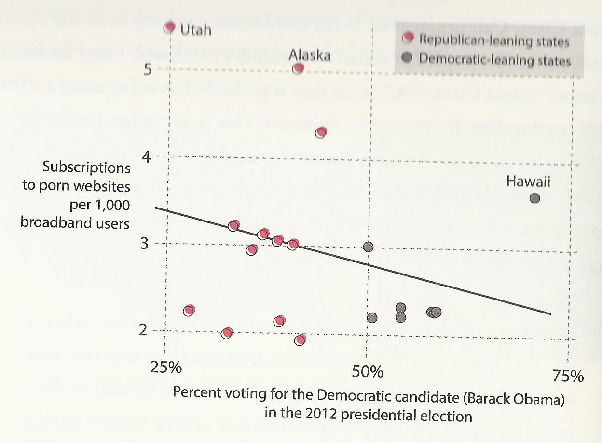

Cette fois la consomation de pornographie n'est plus représentée par le nombre de pages vues sur PornHub mais par le nombre d'abonnements à des sites pornographiques payants.

Mis à part le côté puéril d'essayer de discréditer ses adversaires en fonction de leur consommation supposée de pornographie, la morale est qu'en choisissant bien vos données, vous pouvez faire dire ce que vous voulez à un graphique.

### Mentir en interprétant les données

#### Le vaccin tue plus que la variole

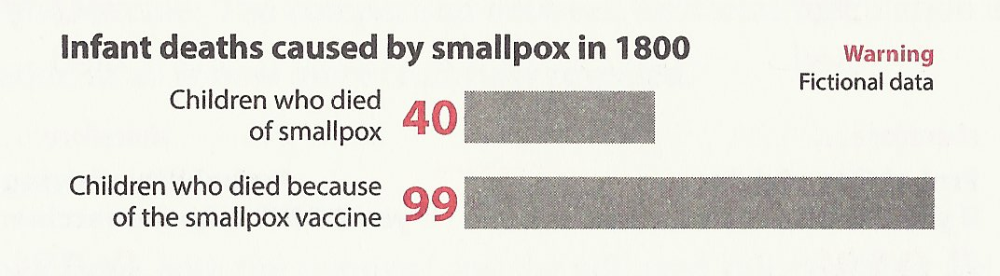

Ce graphique fictif créé par Alberto Cairo démontre que plus d'enfants meurent du vaccin contre la variole que de la maladie elle-même. Est-ce un argument pour arrêter de vacciner? À première vue, oui. Mais regardons à quoi correspondent ces chiffres.

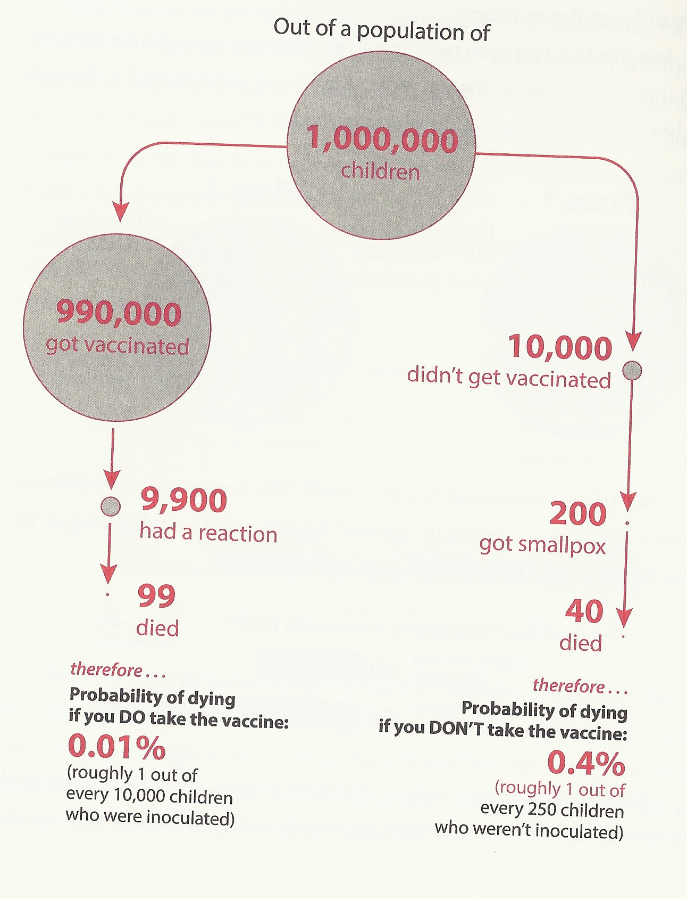

Sur une population de 1 million d'enfants, 990'000 sont vaccinés, 10'000 ne le sont pas. Les chances de mourir sont respectivement de 0.01% et de 0.4%. Un enfant a 40 fois plus de chances de mourir s'il n'est pas vacciné.

## La cartographie

Dans le conte [Del rigor en la ciencia](https://es.wikipedia.org/wiki/Del_rigor_en_la_ciencia), le poète argentin [Jorge Luis Borges](https://fr.wikipedia.org/wiki/Jorge_Luis_Borges), raconte l'histoire d'un empire qui créa une carte de son territoire à l'échelle 1:1 pour pouvoir représenter tout ce qui s'y trouve. Quelques fragments sont encore visibles dans le désert...

Une carte représentant absoluement tout, ne sert à rien. La cartographie, encore plus que les autres formes de visualisations, est l'art de choisir de représenter une séléction de la réalité.

Ceci est une carte du parcours de chez moi à la HEIG.

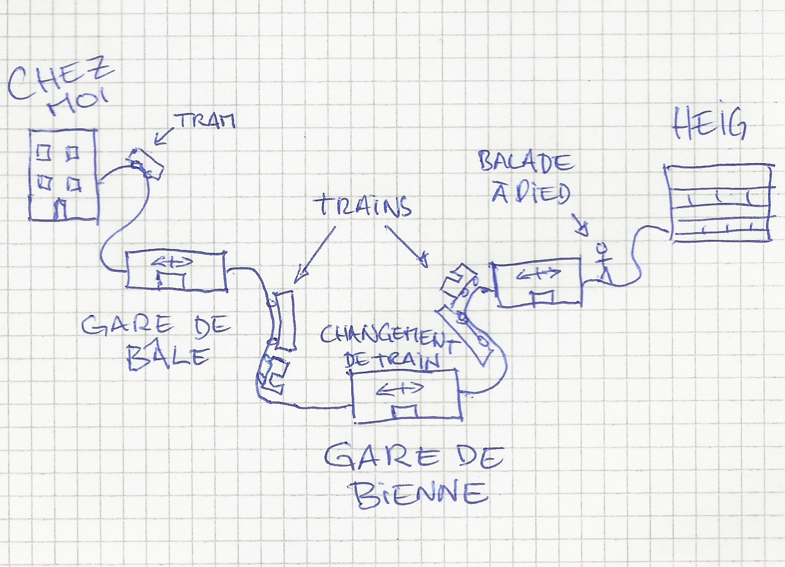

Ne pouvant pas représenter chaque bâtiment, chaque champs, chaque arbre... que je passe en chemin, j'ai choisi de ne montrer que les moyens de transports et les lieux où je passe d'un moyen de transport à un autre. Il manque même des repères aussi grands que le Jura ou les lacs de Bienne et de Neuchâtel.

Un cartographe ne vous montre que ce qu'il veut montrer. Ou peut montrer. J'aurais bien ajouté quelques détails pour des raisons ésthétiques mais je suis limité par mes talents de dessinateur. Trouver les données était facile, c'est ce que je faisais à chaque cours avant le "confinement". Mais ce n'est pas très intéressant. La difficulté est de trouver des données intéressantes.
