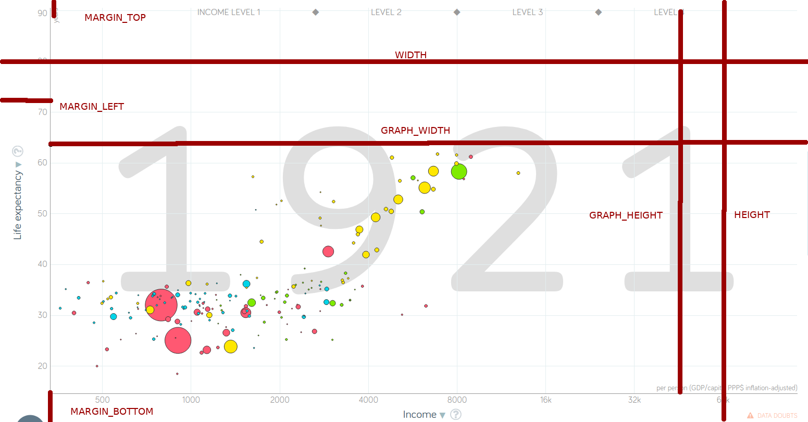

# Recréer le graphique de [gapminder](https://www.gapminder.org/tools/#$chart-type=bubbles) avec D3

## Mise en place

### Un dossier `src`

Dans le dossier `modules/rosling/graphique_d3/src`

### Un fichier HTML, `index.html`

```html
<!DOCTYPE html>
<html>
  <head>
    <title>Rosling</title>
    <link rel="stylesheet" href="index.css" />
  </head>
  <body>
    <div id="content">
      <h1>Life expectancy and GDP per capita</h1>
      <div id="graph"></div>
      <input id="year-input" type="range" min="1800" max="2020" value="2020" />
      <p>Data from <a href="https://www.gapminder.org/data/documentation/gd000/">gapminder</a></p>
    </div>
    <script src="index.js"></script>
  </body>
</html>
```

* La `<div id="graph">` est où nous allons dessiner le graphique.
* L'élément [`<input type="range">`](https://developer.mozilla.org/en-US/docs/Web/HTML/Element/input/range) est le "slider" qui définira quelle année visualiser.
* Nous référençons un fichier CSS `index.css` et un fichier javascript `index.js`

### Un fichier CSS, `index.css`

```css
html, body {
  margin: 0;
  padding: 0;
  font-family: -apple-system,BlinkMacSystemFont,Segoe UI,Helvetica,Arial,sans-serif,Apple Color Emoji,Segoe UI Emoji;
  width: 100%;
  font-size: 12px;
  color: rgb(51, 51, 51);
}

#content {
  width: 95%;
  margin: auto;
}

#year-input {
  width: 100%;
  background: #f1f1f1;
}

#year-input::-webkit-slider-thumb, #year-input::-moz-range-thumb {
  -webkit-appearance: none;
  appearance: none;
  width: 25px;
  height: 25px;
  background: rgb(109, 109, 109);
  cursor: pointer;
}

.axis {
  opacity: 0.5;
  font-size: 8;
}

a {
  text-decoration: none;
}
```

### Un fichier JavaScript `index.js`

Le fichier `index.js` sera le point de départ de notre scripte. Pour ne pas tout écrire dans le même scripte, nous allons diviser le code en plusieurs fichiers pour après les importer dans `index.js`.

Pour l'instant n'ajoutons que

```js
console.log('salut')
```

pour vérifier que la mise en place fonctionne

### Commande de développement

Ajoutons une commande dans `package.json`, pour créer le site.

```js
{
  // ...
  "scripts": {
    // ...
    "rosling": "parcel modules/rosling/graphique_3d/src/index.html --out-dir modules/rosling/graphique_3d/dist",
    // ...
  },
  // ...
}
```

Nous pouvons démarrer le serveur de développement avec:

```
npm run rosling
```

La page s'affiche, le CSS semble fonctionner et `"salut"` s'affiche dans la console.

## Ecouter les changements d'année

Nous souhaitons savoir quelle année représenter quand on bouge le "slider".

Dans `index.js`

```js
// prendre l'"input" avec l'"id" "year-input"
const input = document.getElementById('year-input')

// quand la valeur change nous souhaitons faire quelque chose
const onYearChange = year => {
  // pour l'instant nous ne faisons qu'envoyer l'année à la console
  console.log(year)
}

// écouter les changements sur la valeur de "input"
input.addEventListener('input', e => onYearChange(Number(e.target.value)))
```

Quand nous bougeons le "slider", l'année s'affiche dans la console.

## Les dimensions du graphique

Avant de commencer à dessiner le graphique, il nous faut en définir les dimensions. Nous le faisons dans un fichier `config.js`

```js
export const WIDTH = 1000
export const HEIGHT = 400
export const MARGIN_LEFT = 30
export const MARGIN_TOP = 20
export const MARGIN_BOTTOM = 30
export const GRAPH_WIDTH = WIDTH - MARGIN_LEFT
export const GRAPH_HEIGHT = HEIGHT - MARGIN_BOTTOM - MARGIN_TOP
```



## Les échelles

Il nous faut des échelles pour trois dimensions

* L'axe x, basé sur le PNB par habitant
* L'axe y, basé sur l'espérance de vie
* Le rayon de chaque bulle, basé sur la population

que nous mettons dans un fichier `scales.js`

```js
import { scaleLinear, scaleLog, scalePow } from 'd3'
import { GRAPH_WIDTH, GRAPH_HEIGHT } from './config'

export const xScale = scaleLog().domain([500, 140000]).range([0, GRAPH_WIDTH])
export const yScale = scaleLinear().domain([20, 85]).range([GRAPH_HEIGHT, 0])
export const rScale = scalePow().domain([25000, 1000000000]).range([2, 40])
```

Les échelles `scaleLinear`, `scaleLog` et `scalePow` sont importées de `d3` et la largeur et hauteur sont importés de `config.js` créé plus haut.

Pendant que nous y sommes, ajoutons une fonction qui retourne une couleur en fonction de la région.

```js
export const getColorByRegion = ({ region }) => {
  switch(region) {
    case 'south_asia':return '#66c2a5'
    case 'europe_central_asia': return '#fc8d62'
    case 'middle_east_north_africa': return '#8da0cb'
    case 'sub_saharan_africa': return '#e78ac3'
    case 'america': return '#a6d854'
    default: return '#ffd92f'
  }
}
```

## Créer les bulles

Pour créer les bulles, il nous faut importer les données, le fichier `data.json` crées tout à l'heure.

Dans `index.js`

```js
import data from '../../data/data.json'
```

Nous allons utiliser `select` de `d3` pour séléctionner la `<div id="graph">`, y ajouter un `<svg>` avec les dimension définies dans `config.js`. Au SVG nous ajoutons un groupe, `<g>`, dans lequel nous créons un élément `<circle>` pour chaque pays dans `data`.

```js
import data from '../../data/data.json'
import { select } from 'd3'
import { WIDTH, HEIGHT, MARGIN_LEFT, MARGIN_TOP } from './config'
import { getColorByRegion } from './scales'

const div = select('#graph')

const svg = div.append('svg').attr('viewBox', `0 0 ${WIDTH} ${HEIGHT}`)

const bubblesGroup = svg.append('g')
  .attr('transform', `translate(${MARGIN_LEFT}, ${MARGIN_TOP})`)

const bubbles = bubblesGroup.selectAll('circle')
  .data(data)
  .enter()
  .append('circle')
  .attr('fill', getColorByRegion)
  .attr('fill-opacity', 0.4)
  .attr('stroke', getColorByRegion)
```

Le groupe `bubblesGroup` est placé de manière a laisser de la place à l'axe Y sur la gauche et a laisser un peu de place sur le haut pour que les plus grosses bulles ne soient pas coupées.

La position des bulles (les attributs `cx` et `cy`) ainsi que le rayon, `r`, dépendrons de l'année. Nous ne les ajoutons pas tout de suite. Par contre la région ne change pas avec les années, nous pouvons déjà la définir. C'est la partie

```js
  .attr('fill', getColorByRegion)
  .attr('fill-opacity', 0.4)
  .attr('stroke', getColorByRegion)
```

où nous utilisons la fonction `getColorByRegion` définie dans `scales.js`. Le remplissage des bulles est légèrement transparent pour qu'on puisse voir les bulles plus petites cachées derrière les grosses.

## Mettre à jour les bulles en fonction de l'année

Plus haut nous avons créé une fonction `onYearChange` appellée à chaque fois que l'année change. C'est à l'intérieur de celle-ci nous allons définir la position des bulles et leur rayon.

```js
const onYearChange = year => {
  const index = year - 1800
  bubbles
    .attr('cx', d => xScale(d.gdp[index]))
    .attr('cy', d => yScale(d.lex[index]))
    .attr('r', d => rScale(d.pop[index]))
}
```

Pour chaque pays, les données sont sous forme de tableau allant de la première année, 1800, à la dernière, 2020. Nous trouvons l'indexe en soustrayant la première année à l'année que nous souhaitons montrer. Nous utilisons les échelles définies dans `scales.js`.

Maintenant en changeant la position du "slider", nous voyons les bulles changer de place. Le problème est que nous ne voyons aucune bulle quand la page charge. Celles-ci n'apparaissent que quand nous changeons l'année.

Comme nous avons défini 2020 comme la valeur par défaut du "slider", nous allons faire de même pour les bulles.

```html
<input id="year-input" type="range" min="1800" max="2020" value="2020" />
```

C'est la partie `value="2020"`.

Ajoutons les valeurs de 2020 quand les bulles sont initialisées, en dehors de `onYearChange`.

```js
const bubbles = bubblesGroup.selectAll('circle')
  .data(data)
  .enter()
  .append('circle')
  // ...
  .attr('cx', d => xScale(d.gdp[220]))
  .attr('cy', d => yScale(d.lex[220]))
  .attr('r', d => rScale(d.pop[220]))
```

## Ajouter les légendes

Il nous faut quelques éléments pour que le lecteur comprenne le graphique:

* Montrer l'année
* Montrer ce que signifient les axes
* Montrer le nom du pays quand la souris passe au dessus d'une bulle

Comme notre fichier `index.js` commence à être un peu chargé, nous allons mettre tous les éléments dans un fichier `elements.js`:

```js
import data from '../../data/data.json'
import { select } from 'd3'
import { WIDTH, HEIGHT, MARGIN_LEFT, MARGIN_TOP } from './config'
import {
  getColorByRegion,
  rScale,
  xScale,
  yScale,
} from './scales'

const div = select('#graph')

const svg = div.append('svg').attr('viewBox', `0 0 ${WIDTH} ${HEIGHT}`)

const bubblesGroup = svg.append('g')
  .attr('transform', `translate(${MARGIN_LEFT}, ${MARGIN_TOP})`)

export const bubbles = bubblesGroup.selectAll('circle')
  .data(data)
  .enter()
  .append('circle')
  .attr('fill', getColorByRegion)
  .attr('fill-opacity', 0.4)
  .attr('stroke', getColorByRegion)
  .attr('cx', d => xScale(d.gdp[220]))
  .attr('cy', d => yScale(d.lex[220]))
  .attr('r', d => rScale(d.pop[220]))

export const input = document.getElementById('year-input')
```

`bubbles` et `input` sont exportés pour que nous puissions les utiliser dans `index.js`. C'est dans ce fichier que nous allons "orchestrer" les événements.

```js
import { bubbles, input } from './elements'
import { rScale, xScale, yScale } from './scales'

const onYearChange = year => {
  const index = year - 1800
  bubbles
    .attr('cx', d => xScale(d.gdp[index]))
    .attr('cy', d => yScale(d.lex[index]))
    .attr('r', d => rScale(d.pop[index]))
}

input.addEventListener('input', e => onYearChange(Number(e.target.value)))
```

Dans `index.js` nous ne gardons que l'événement `onYearChange`.

### Afficher l'année

Dans `elements.js` nous initialisons et exportons `yearDisplay`:

```js
const YEAR_DISPLAY_SIZE = 100

export const yearDisplay = svg.append('text')
  .attr('x', WIDTH)
  .attr('y', HEIGHT - MARGIN_BOTTOM - 20)
  .attr('font-size', 100)
  .attr('text-anchor', 'end')
  .attr('opacity', 0.5)
  .text(2020)
```

Comme avec les bulles la valeur de départ est 2020. Dans `index.js` nous allons mettre à jour le contenu quand l'année change.

```js
const onYearChange = year => {
  const index = year - 1800

  bubbles
    .attr('cx', d => xScale(d.gdp[index]))
    .attr('cy', d => yScale(d.lex[index]))
    .attr('r', d => rScale(d.pop[index]))

  yearDisplay.text(year) // <-- ici
}
```

### Afficher les axes

Comme décrit dans le [cours sur les axes d3](https://observablehq.com/@idris-maps/d3-definir-les-axes), nous allons utiliser les fonctions `axisBottom` et `axisLeft` pour générer les axes. Nous allons les définir dans `elements.js`. 

```js
const axisGroup = svg.append('g').attr('class', 'axis')

axisGroup.append('g')
  .attr('transform', `translate(${MARGIN_LEFT}, ${MARGIN_TOP})`)
  .call(axisLeft().scale(yScale))

axisGroup.append('g')
  .attr('transform', `translate(${MARGIN_LEFT}, ${HEIGHT - MARGIN_BOTTOM})`)
  .call(axisBottom().scale(xScale).tickFormat(d => `${d / 1000}`))
```

Nous ajoutons un élément `<g>` au svg appellé `axisGroup` dans lequel nous ajoutons les deux axes en appellant les fonctions `axisBottom` et `axisLeft` avec l'échelle correspondante.

Les axes ne disent rien au lecteur en tant que telles. Ajoutons des textes pour décrire ce qu'ils représentent.

```js
axisGroup.append('text')
  .text('Life expectancy')
  .attr('x', MARGIN_LEFT)
  .attr('y', MARGIN_TOP)
  .attr('font-size', AXIS_LABEL_SIZE)
  .attr('transform', `rotate(90, ${MARGIN_LEFT}, ${MARGIN_TOP}) translate(0, -5)`)

axisGroup.append('text')
  .text('GDP per capita')
  .attr('x', WIDTH)
  .attr('y', HEIGHT - MARGIN_BOTTOM - 3)
  .attr('text-anchor', 'end')
  .attr('font-size', AXIS_LABEL_SIZE)
```

Puisque les noms de pays sont en anglais, j'utilise cette même langue pour la description des axes. Les axes et leurs définitions ne vont pas changer dépendant de l'année. Nous n'avons pas besoin de les exporter.

### Afficher le nom du pays quand la souris passe sur une bulle

Dans `elements.js`, créons un élément `<text>` dont le contenu sera rempli et placé quand la souris passe sur une bulle.

```js
export const countryDisplay = bubblesGroup.append('text')
  .attr('font-size', 12)
  .attr('text-anchor', 'middle')
```

Nous ne définissons que l'élément et deux attributs de présentation, `font-size` et `text-anchor`. La position et le contenu doivent être définis quand la souris passe par dessus une bulle. 

Définissons ces événements dans `index.js`.

```js
bubbles.on('mouseover', function(d) {
  const [x, y] = mouse(this)
  countryDisplay.text(d.name)
    .attr('x', x)
    .attr('y', y - 20)
})
```

Quand la souris passe sur une bulle (l'événement `mouseover`), nous utilisons la fonction `mouse` de d3 pour calculer sa position par rapport au SVG.

Le nom du pays (`d.name`) devient le contenu de `countryDisplay`. Et l'élément est positionné au dessus de la souris (`.attr('y', y - 20)`).

---

### :point_up: `this` en javascript

Si vous êtes obeservateurs, vous avez remarqué que j'ai utilisé une fonction "à l'ancienne" ici. `function(d) {}` plutôt que `d =>` comme nous l'avons fait jusqu'ici. La raison est que si nous utilisons `d =>` la fonction n'a pas de contexte `this`.

[`this` expliqué par MDN](https://developer.mozilla.org/en-US/docs/Web/JavaScript/Reference/Operators/this)

`this` porte beaucoup à confusion, il est en général préférable de ne pas l'utiliser si possible. Enfin c'est ma statégie personnelle. Vous faites comme vous voulez. Ici nous n'avons de toutes manières pas le choix. Pour faire court, `this` est le context dans lequel une fonction est appellée. Ici il s'agit de l'élément sur lequel la souris passe. La fonction `mouse` de d3 nécessite ce contexte.

---

Revenons à notre événement `mouseover`. Il fonctionne plus ou moins mais il nous reste quelques problèmes à résoudre.

1. Quand la souris n'est plus sur une bulle le texte reste affiché
2. Quand nous bougeons la souris à l'intérieur d'une bulle, le texte ne suit pas
3. Il est difficile de distinguer de quelle bulle on parle quand il y en a plusieurs au même endroit.

Commençons par le dernier, distinguer la bulle sur laquelle la souris passe.

```js
bubbles.on('mouseover', function(d) {
  const [x, y] = mouse(this)

  countryDisplay.text(d.name)
    .attr('x', x)
    .attr('y', y - 20)

  select(this) // ici
    .attr('stroke', 'black')
})
```

Quand la souris passe par dessus une bulle, son contour devient noir plutôt que la couleur de la région. Nous avons encore utilisé `this`, cette fois pour séléctionner la bulle pour rendre pour lui donner un `stroke` noir.

Nous avons un problème de plus, chaque bulle sur laquelle nous sommes passé a maintenant un contour noir. Pour le résoudre, ainsi que le problème 1 plus haut, il nous faut ajouter un événement quand la souris n'est plus au dessus de la bulle.

```js
bubbles.on('mouseout', function() {
  countryDisplay.text('')
  select(this)
    .attr('stroke', getColor)
})
```

Quand la souris sort de la bulle nous mettons un contenu vide sur `countryDisplay` et le contour de la bulle retrouve sa couleur définie en fonction de la région.

Pour que le texte suive la souris quand nous bougeons à l'intérieur de la bulle:

```js
bubbles.on('mousemove', function() {
  const [x, y] = mouse(this)
  countryDisplay
    .attr('x', x)
    .attr('y', y - 20)
})
```

Quand la souris bouge, nous dépaçons `countryDisplay`.

---

## Fonctions d3 utilisées

* [select](https://github.com/d3/d3-selection)
* [mouse](https://github.com/d3/d3-selection#mouse)
* [axisBottom, axisLeft](https://github.com/d3/d3-axis)
* [scaleLinear, scaleLog, scalePow](https://github.com/d3/d3-scale)


