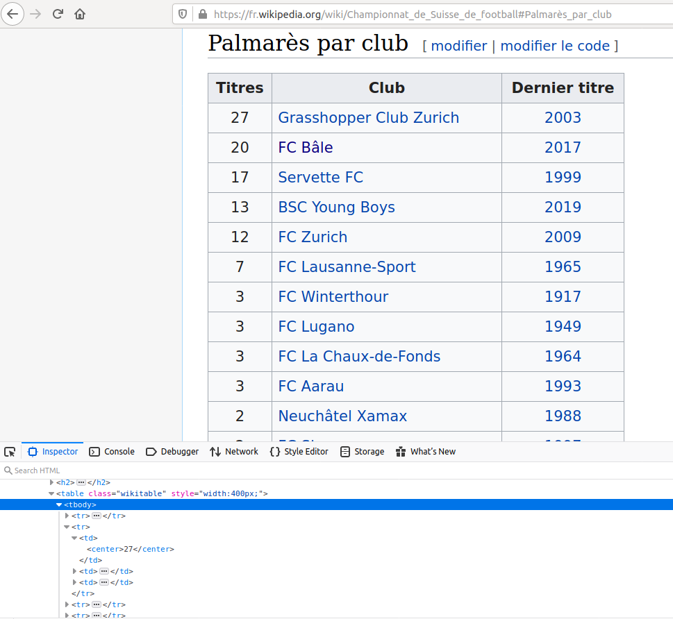

# Titres de super league

Nous avons vu que pour les "applications monopage", nous pouvions observer les requêtes du navigateur pour les imiter et récupérer des données. Toutes les pages web ne sont pas des "applications monopage", parfois le serveur ne retourne qu'une page HTML contenant déjà toutes les données.

Wikipedia par exemple contient beaucoup de données intéressantes mais ne sert que des pages HTML. Pour démontrer comment "scraper" ce type de site, nous allons télécharger le nombre de titres de "Super league" par club de [cette table](https://fr.wikipedia.org/wiki/Championnat_de_Suisse_de_football#Palmar%C3%A8s_par_club).

## Télécharger la page

```
curl https://fr.wikipedia.org/wiki/Championnat_de_Suisse_de_football > page.html
```

## [`cheerio`](https://cheerio.js.org/)

Pour sortir les données de notre page, nous allons utiliser la librairie `cheerio` qui permet d'utiliser une syntaxe proche de [`jQuery`](https://jquery.com/) pour tirer des données d'une page HTML.

```
npm install cheerio --save
```

Dans un fichier [`getData.js`](getData.js):

```js
const cheerio = require('cheerio')
const fs = require('fs')

const page = fs.readFileSync('page.html', 'utf-8')

const $ = cheerio.load(page)
```

Nous importons les librairies `cheerio` et `fs` (qui n'a pas besoin d'être installée, elle vient avec node). Nous utilisons `fs.readFileSync` pour lire la page téléchargée plus haut et la chargeons dans `cheerio` avec `cheerio.load(page)`.

## Observer la structure

Inspectons la table qui nous intéresse dans le navigateur.



Elle ressemble à ça:

```html
<table class="wikitable" style="width:400px;">
  <tbody>
    <tr>
      <th>Titres</th>
      <th>Club</th>
      <th>Dernier titre</th>
    </tr>
    <tr>
      <td><center>27</center></td>
      <td><a href="/wiki/Grasshopper_Club_Zurich" title="Grasshopper Club Zurich">Grasshopper Club Zurich</a></td>
      <td><center><a href="/wiki/Championnat_de_Suisse_de_football_2002-2003" title="Championnat de Suisse de football 2002-2003">2003</a></center>
      </td>
    </tr>
    <tr>
      <td><center>20</center></td>
      <td><a href="/wiki/FC_B%C3%A2le" title="FC Bâle">FC Bâle</a></td>
      <td><center><a href="/wiki/Championnat_de_Suisse_de_football_2016-2017" title="Championnat de Suisse de football 2016-2017">2017</a></center>
      </td>
    </tr>
    <!-- ... -->
  </tbody>
</table>
```

Il nous faut:

1. Trouver l'élément qui englobe toutes les données.
2. Définir le chemin à partir de cet élément pour trouver les données

L'élément qui contient tout est ici `<tbody>`.

Celui-ci contient des `<tr>` et chaque `<tr>` contient les informations pour une équipe. Sauf le premier `<tr>` qui contient les titres des colonnes.

Nous allons chercher le nombre de titres et le nom du club pour chaque ligne, chaque `<tr>`

Le nombre de titres est dans un élément `<center>` du premier `<td>` de chaque `<tr>`.

Le nom du club est l'attribut `title` de l'élément `<a>` du deuxième `<td>` de chaque `<tr>`.

## Chercher les éléments avec `cheerio`

Maintenant que nous savons où se trouve ce que nous voulons, utilisons `cheerio` pour les trouver dans la page.

Pour trouver le `<tbody>` qui englobe ce qui nous intéresse, nous pouvons utiliser l'inspecteur du navigateur. En faisant un click droit sur `<tbody>`, je choisis `Copy > CSS Selector` dans Firefox. C'est `Copy > Selector` dans Chrome.

Dans Firefox, ça donne:

```
table.wikitable:nth-child(36) > tbody:nth-child(1)
```

Dans Chrome:

```
#mw-content-text > div > table:nth-child(36) > tbody
```

Il y a plusieurs manière de faire des [séléctions CSS](https://developer.mozilla.org/fr/docs/Apprendre/CSS/Building_blocks/Selectors/S%C3%A9lecteurs_de_type_classe_ID). Les deux marchent.

Utilisons notre sélecteur pour définir `tbody`:

```js
const tbody = $('table.wikitable:nth-child(36) > tbody:nth-child(1)')
```

Nous avons l'élément parent. Il nous faut maintenant les `<tr>`:

```js
const trs = $('tr', tbody)
```

Ici nous passons `tbody` en deuxième argument pour dire à `cheerio` de ne chercher les éléments `tr` que dans `tbody`, pas dans toute la page.

Pour chaque `tr`, si ce n'est pas le premier, nous allons chercher le nombre de titres et le nom du club:

```js
trs.each((index, tr) => {
  if (index !== 0) {
    console.log({
      titres: $('td:nth-child(1) > center', tr).text(),
      club: $('td:nth-child(2) > a', tr).attr('title')
    })
  }
})
```

Le sélecteur `td:nth-child(1) > center` prends l'élément `<center>` du premier `<td>`, `td:nth-child(1)`. Nous utilisons la méthode `.text()` pour récupérer le texte à l'intérieur de la sélection.

Le sélecteur `td:nth-child(2) > a` prends l'élément `<a>` du deuxième `<td>`, `td:nth-child(2)`. Nous utilisons la méthode `.attr()` pour chercher l'attribut `title`.

**ATTENTION** `cheerio` utilise la syntaxe `jquery`. Contrairement aux méthodes sur les tableaux telles que `.map`, `.forEach` ou `.filter`, ici les arguments sont inversés. L'index est le premier argument et l'élément de la liste le deuxième.

Les données s'affichent dans la console. Mais créons un tableau `result` où nous mettons toutes les données avec `result.push()`. Et passons ce résultat à la console pour le sauver dans un fichier.

```js
let result = []

trs.each((index, tr) => {
  if (index !== 0) {
    result.push({
      titres: $('td:nth-child(1) > center', tr).text(),
      club: $('td:nth-child(2) > a', tr).attr('title')
    })
  }
})

console.log(
  JSON.stringify(
    result.map(d => ({ ...d, titres: Number(d.titres) }))
  )
)
```

Maintenant la commande:

```
node getData > data.json
```

crée un fichier [`data.json`](data.json) avec nos données.
